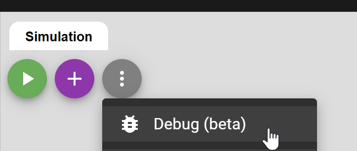

# Interactive debugger

Wokwi has a built-in debugger that allows you to step through your code, inspect variables, and set breakpoints. The debugger is currently in beta, and is available for AVR microcontrollers: Arduino Uno, Arduino Nano, Arduino Mega, and the ATtiny85.

If you wish to debug other microcontrollers, such as the ESP32 or the Raspberry Pi Pico, you can use [Wokwi for VSCode](../vscode/getting-started), which has [integrated debugger support](../vscode/debugging).

## Using the debugger

To start debugging your code, click the menu button in the simulator toolbar, and select **Debug**:

You can set breakpoints by clicking on the left margin of the code editor. The debugger will pause the execution when the program reaches the breakpoint.

When running in debug mode, you will see the debug toolbar above the code editor. The toolbar contains the following buttons:

- **Continue** - Continue running the program. If the program is paused at a breakpoint, the debugger will continue running until the next breakpoint.

- **Step over** - Step over the current line of code. If the current line is a function call, the debugger will step over the function call and stop at the next line of code.

- **Step into** - Step into the current line of code. If the current line is a function call, the debugger will step into the function and stop at the first line of the function.

- **Step out** - Step out of the current function.

## Debugging panes

The debugging panes appear when you pause the program (either manually, or at a breakpoint). You'll find the panes below the diagram, next to the [Serial Monitor](./serial-monitor) pane.

### Call stack

The call stack shows the current function call stack. The top of the stack is the currently executing function. The bottom of the stack is the main function.

### Variables

The variables pane shows the current values of the variables in the current scope. The variables are grouped by scope: local variables and global variables (which also include register values).
