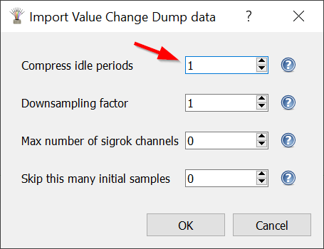

import LogicAnalyzerI2CImage from './logic-analyzer-i2c-decoder.png';

The [Logic Analyzer](../parts/wokwi-logic-analyzer) records the values of digital signals in your project. It's a powerful debugging tool, and can help you diagnose issues in your circuit and code. It's also very useful as a learning aid.

Some use cases include:

- Observe the PWM signal generated by the [analogWrite() function](https://www.arduino.cc/reference/en/language/functions/analog-io/analogwrite/)
- Look at the [Servo](../parts/wokwi-servo) control signal
- Develop and debug PIO machines for the [Raspberry Pi Pico](../parts/wokwi-pi-pico)
- Learn about the I2C protocol by looking at the SCL/SDA signals

<figure>
  
  <figcaption>Logic Analyzer: I2C protocol signals decoded in PulseView</figcaption>
</figure>

## Features

The Wokwi Logic Analyzer has 8 digital channels, called D0 to D7. It has a sample rate of 1GHz, which should be more than enough for most applications.

Each channel has an activity LED that turns green whenever there is an activity on the channel. The activity LEDs provide an easy way to see that the signals are connected
correctly.

The logic analyzer has a small display. It shows the number of samples captured since the simulation started.

The [configurable trigger](#using-the-trigger) lets you record just part of the data. For instance, you can start recording on button press, or record only while SPI communication is active (using the SS pin as a trigger).

## Using the Logic Analyzer

First, add the Logic Analyzer to your project. You can do this by clicking the purple Plus button, then selecting "Logic Analyzer (8 channels)".

Next, connect the signals you want to record to the Logic Analyzer pins. For instance, if you want to record the I2C communication between an Arduino Uno and some peripheral (such as the [DS1307 RTC](../parts/wokwi-ds1307)), you can connect pins A4/A5 (which carry the SDA/SCL signals) to pins D0/D1 of the Logic Analyzer.

Start the simulation. You should see the green activity LEDs blink as the signals are coming in, and the number of samples show go up.

To view the capture, stop the simulation. This will download a file called "wokwi-logic.vcd" to your computer. The file contains the recorded signals in [Value Change Dump](https://en.wikipedia.org/wiki/Value_change_dump) format.

You can use software such as PulseView or GTKWave to open and view the capture files. These software also include powerful protocol analyzers that can decode many common protocols such as UART, I2C, WS2812, and many others.

### Using the Trigger

By default, the logic analyzer records data for the entire duration of the simulation. The trigger allows you to control the recording of data, by setting the value of one of the digital analyzer's input pins (D7 by default).

Here are some examples for common use cases:

- [Start recording when a button is pressed](https://wokwi.com/projects/313698551063380544) - Set the `triggerMode` to "edge", and connect the trigger pin (D7) to ground through a pull-down resistor. Connect the other end of the button to the positive power supply (VCC/5V).
- [Record only while the button is pressed](https://wokwi.com/projects/313706149095408193) - Same setup as above, but the `triggerMode` is set to "level".
- [Start recording after 1.5 seconds](https://wokwi.com/projects/313706408220557888) - Set `triggerMode` to "edge", connect the trigger pin (D7) and change the pin level to high after 1.5 seconds.

Use the `triggerPin` and `triggerLevel` attributes to configure the trigger pin and set the trigger level ("high" or "low"). Check out the [wokwi-logic-analyzer documentation](../parts/wokwi-logic-analyzer) for more information.

### Viewing the data in PulseView

PulseView an open source Logic Analyzer GUI. It runs on Linux, Windows, Mac OS X, and there's even an Android version. You can visit their [downloads page](https://sigrok.org/wiki/Downloads) to get the latest version.

Load the recorded signal (VCD) file by clicking on the small arrow next to the "Open" button, and choosing: "Import Value Change Dump data..."


You'll see a dialog where you can choose the VCD file to import. Once you selected a file, there'll be another dialog with import options:



Unfortunately, the default options usually cause PulseView to consume a lot of RAM and become sluggish. You can reduce the memory usage by setting **Downsampling factor**. A value of **50** should work for most use cases. The following table lists some common values:

| Downsampling factor | Sample rate | When to use?                                          |
| ------------------- | ----------- | ----------------------------------------------------- |
| 1000                | 1MHz        | Low frequency signals / long recordings (10+ minutes) |
| **50**              | **20MHz**   | Common signals (UART, I2C, LED PWM, WS2812, etc.)     |
| 10                  | 100MHz      | High speed signals (10MHz+)                           |
| 1                   | 1GHz        | Very high speed signals (50MHz+)                      |

After confirming the import options, you should see the imported signals on the screen. The signal names will be "logic.D0", "logic.D1", etc.

To learn more about using PulseView, please consult the [PulseView user manual](https://sigrok.org/doc/pulseview/unstable/manual.html).

#### Configuring Windows to open VCD files in PulseView

You can configure Windows to automatically open VCD files in PulseView. Open a command prompt (cmd) window **as administrator**, and type the following commands:

```
ftype vcdfile="%ProgramFiles%\sigrok\PulseView\pulseview.exe" "-I" "vcd:downsample=50" "%1"
assoc .vcd=vcdfile
```

Note that these commands don't work in powershell. The only work in cmd with Administrator privileges. The command sets the Downsampling factor to 50, but you can choose a different value that fits your needs (see table above).

### Viewing the data in GTKWave

[GTKWave](http://gtkwave.sourceforge.net/) is an open source, cross-platform wave viewer software. GTKWave can open VCD files generated by the Wokwi Logic Analyzer.

The [wokwi2gtkwave Python script](https://github.com/bvandepo/wokwi2gtkwave) is a user-contributed automation project for using GTKWave with Wokwi: it can monitor your downloads directory and automatically open new files with GTKWave. The script also configures GTKWave to automatically display the signals from your VCD files and zoom them to fit your screen.
