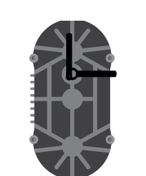

A concentric biaxial stepper motor comprised of two stepper motors packaged in a single enclosure

## Pin names

| Name | Description                                 |
|------|---------------------------------------------|
| A1-  | Outer shaft motor's coil A negative signal  |
| A1+  | Outer shaft motor's coil A positive signal  |
| B1+  | Outer shaft motor's coil B positive signal  |
| B1-  | Outer shaft motor's coil B negative signal  |
| A2-  | Inner shaft motor's coil A negative signal  |
| A2+  | Inner shaft motor's coil A positive signal  |
| B2+  | Inner shaft motor's coil B positive signal  |
| B2-  | Inner shaft motor's coil B negative signal  |

## Attributes

| Name            | Description                                                                                                                         | Default value |
|-----------------|-------------------------------------------------------------------------------------------------------------------------------------|---------------|
| outerHandLength | Controls the length of the outer shaft's hand. Changing the length extends the hand shape. Note the hand can extend beyond the body | "30"          |
| outerHandAngle  | Controls the angle of the outer shaft's hand. Changing the angle rotates the hand shape.                                            | "0"           |
| outerHandColor  | Controls the color of the outer shaft's hand.                                                                                       | "gold"        |
| outerHandShape  | Controls the shape of the outer shaft's hand. Set to one of 3 predefined shapes: "plain", "arrow", "ornate"                         | "plain"       |
| innerHandLength | Controls the length of the inner shaft's hand. Changing the length extends the hand shape. Note the hand can extend beyond the body | "30"          |
| innerHandAngle  | Controls the angle of the inner shaft's hand. Changing the angle rotates the hand shape.                                           | "0"           |
| innerHandColor  | Controls the color of the inner shaft's hand.                                                                                      | "silver"     |
| innerHandShape  | Controls the shape of the inner shaft's hand. Set to one of 3 predefined shapes: "plain", "arrow", "ornate"                        | "plain"       |

### Examples

| Result                                                                                                                | Attrs                                                                                                                  |
|-----------------------------------------------------------------------------------------------------------------------|------------------------------------------------------------------------------------------------------------------------|
| <wokwi-biaxial-stepper innerHandLength="70" innerHandShape="arrow"/>                                                    | `{ "innerHandLength": "40", "innerHandShape": "arrow"};`                                                               |
| <wokwi-biaxial-stepper innerHandShape="black"outerHandShape="black" innerHandShape="ornate", outerHandShape="ornate" /> | `{ "innerHandShape": "black", "outerHandShape": "black", "innerHandShape": "ornate", "outerHandShape": "ornate"  }` |

## Using the biaxial stepper motor

When using a stepper motor you need two driver chips that can supply large amounts of current to each motor's coils.
Wokwi supports the common [A4988 driver board](wokwi-a4988). 
NOte you can also wire the stepper motor directly to your microcontroller. 
Wokwi uses a digital simulation engine, so the coil current is not taken into account.

You can use a variety of Arduino libraries to control the stepper motor: Stepper, AccelStepper, etc.

### Simulation Behavior

Each of the two steppers can be controlled independently by sending the correct signals either to the driver chip or directly to
the stepper pins. 
Each The stepper motor moves 1.8 degrees per step (200 steps per revolution). 
The motor also supports half-stepping (0.9 degrees per step / 400 steps per revolution). 
You can even use smaller microsteps (e.g. 1/4 or 1/8 step), 
but the simulated motor only displays the angle in half-step resolution. 
For more information, check out the [A4988 microstepping configuration table](wokwi-a4988#microstepping-configuration).

## Simulator examples

- [Stepper motor using the Arduino Stepper library](https://wokwi.com/projects/327324886912467538)
- [Direct control of the motor (no library)](https://wokwi.com/projects/327360139702043220)
- [Advanced control with the AccelStepper library and potentiometer](https://wokwi.com/projects/327381547863769683)
- [Manually control the stepper motor using switches and relays](https://wokwi.com/projects/327424914940232274)
