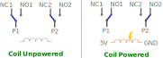

Double Pole Double Throw (DPDT) Relay

<wokwi-ks2e-m-dc5 />

## Pin names

| Name  | Description                                           |
| ----- | ----------------------------------------------------- |
| COIL1 | First terminal of the coil                            |
| COIL2 | Second terminal of the coil                           |
| P1    | First pole                                            |
| NC1   | Normally closed - connected to P1 when coil unpowered |
| NO1   | Normally open - connected to P1 when coil powered     |
| P2    | Second pole                                           |
| NC2   | Normally closed - connected to P2 when coil unpowered |
| NO2   | Normally open - connected to P2 when coil powered     |

## Operation

The relay is an electronic switch with two states: coil unpowered, and coil powered. By default, the coil is unpowered. You can power the coil by applying voltage between the pins COIL1 and COIL2.

When the coil is unpowered, P1 is connected to NC1, and P2 is connected to NC2 (NC means for normally closed/connected).

When the coil is powered, P1 is connected to NO1, and P2 is connected to NO2 (NC means for normally open/disconnected).

The following diagram summarizes the states of the relay:

## Simulator Examples

- [One relay controlling two LEDs](https://wokwi.com/projects/322846360729551444)
- [Relay Flip-Flop](https://wokwi.com/projects/322802227591774802) - Single bit memory element using three relays
