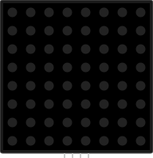

WS2812 NeoPixel Compatible LED Matrix.



## Pin names

| Name | Description                              |
| ---- | ---------------------------------------- |
| DIN  | Data input signal                        |
| VDD  | Positive voltage supply                  |
| VSS  | Ground                                   |
| DOUT | Data output (for chaining to next panel) |

## Attributes

| Name       | Description                                      | Default value |
| ---------- | ------------------------------------------------ | ------------- |
| rows       | Number of rows                                   | "8"           |
| cols       | Number of columns                                | "8"           |
| layout     | Pixel wiring pattern (see below)                 | ""            |
| brightness | Brightness multiplier                            | "1"           |
| pixelShape | Pixel rendering shape: "square", "circle", or "" | ""            |
| pixelSize  | LED package size: "5050", "3535", or "2020"      | "5050"        |

### Layout

The `layout` attribute controls how pixel indices map to physical positions in the matrix:

- `""` (default) - Progressive: all rows go left-to-right
- `"serpentine"` - Alternating row direction (left-to-right, then right-to-left)

Most real-world WS2812 matrix panels use serpentine wiring.

### Pixel rendering

For pixel shape and size options, see [wokwi-led-strip: Pixel rendering](wokwi-led-strip#pixel-rendering).

## Arduino code example

```cpp
#include <Adafruit_NeoPixel.h>

#define MATRIX_PIN 2
#define ROWS 8
#define COLS 8
#define NUM_PIXELS (ROWS * COLS)

Adafruit_NeoPixel matrix(NUM_PIXELS, MATRIX_PIN, NEO_GRB + NEO_KHZ800);

void setup() {
  matrix.begin();
  for (int i = 0; i < NUM_PIXELS; i++) {
    matrix.setPixelColor(i, matrix.Color(0, 0, 150)); // Blue
  }
  matrix.show();
}

void loop() {
}
```

## Simulator examples

- [NeoPixel Matrix Rainbow](https://wokwi.com/projects/456026145122415617)
