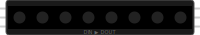

WS2812 NeoPixel Compatible LED Strip.



## Pin names

| Name  | Description                              |
| ----- | ---------------------------------------- |
| VDD   | Positive voltage supply (input side)     |
| DIN   | Data input signal                        |
| VSS   | Ground (input side)                      |
| VDD.2 | Positive voltage supply (output side)    |
| DOUT  | Data output (for chaining to next strip) |
| VSS.2 | Ground (output side)                     |

## Attributes

| Name       | Description                                      | Default value |
| ---------- | ------------------------------------------------ | ------------- |
| pixels     | Number of LEDs in the strip                      | "8"           |
| pixelShape | Pixel rendering shape: "square", "circle", or "" | ""            |
| pixelSize  | LED package size: "5050", "3535", or "2020"      | "5050"        |

### Chaining

You can chain multiple strips together by connecting the DOUT pin of one strip to the DIN pin of the next strip. All LEDs share the same data line and are addressed sequentially.

### Pixel rendering

#### Shape

Set the `pixelShape` attribute to control how each LED is rendered:

- `""` (default) - Smooth rendering (one pixel per LED, scaled up)
- `"square"` - Square pixel rendering
- `"circle"` - Circular pixel rendering

#### Size

Set the `pixelSize` attribute to match real-world LED package dimensions:

| Value    | Package    | Pixel size |
| -------- | ---------- | ---------- |
| `"5050"` | 5×5 mm     | 23 px      |
| `"3535"` | 3.5×3.5 mm | 16 px      |
| `"2020"` | 2×2 mm     | 9 px       |

## Arduino code example

```cpp
#include <Adafruit_NeoPixel.h>

#define STRIP_PIN 2
#define NUM_PIXELS 8

Adafruit_NeoPixel strip(NUM_PIXELS, STRIP_PIN, NEO_GRB + NEO_KHZ800);

void setup() {
  strip.begin();
  for (int i = 0; i < NUM_PIXELS; i++) {
    strip.setPixelColor(i, strip.Color(150, 0, 0)); // Red
  }
  strip.show();
}

void loop() {
  delay(10);
}
```

## See also

- [wokwi-led-matrix](wokwi-led-matrix) - WS2812 NeoPixel Compatible LED Matrix
- [wokwi-led-ring](wokwi-led-ring) - WS2812 NeoPixel Compatible LED Ring

## Simulator examples

- [NeoPixel LED Strip](https://wokwi.com/projects/456031300796110849)
