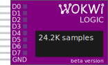

8-Channel Digital Logic Analyzer

## Pin names

Pins D0 to D7 are connected to the input channels of the logic analyzer. There's also a GND pin, which should be connected to the digital ground.

## Attributes

| Name         | Description                                       | Default value |
| ------------ | ------------------------------------------------- | ------------- |
| bufferSize   | Maximum number of samples to collect              | "1000000"     |
| filename     | Name of the recording file, without the extension | "wokwi-logic" |
| triggerMode  | Trigger mode: "off", "level" or "edge"            | "off"         |
| triggerLevel | "high" or "low"                                   | "high"        |
| triggerPin   | "D0" … "D7"                                       | "D7"          |

### Sample buffer

The logic analyzer uses a buffer to store the recorded pin data. Each pin level change (e.g. low to high) occupies one slot in the buffer. The simulator allocates
the memory for the buffer in advance, to ensure fast simulation.

You can choose the size of the buffer by setting the `bufferSize` attribute. Each slot in the buffer uses 9 bytes of RAM. Thus, the default buffer size of 1 million
samples will use about 9 MB of RAM. Allocating a large buffer may strain your browser.

The logic analyzer displays the number of samples captured while the simulation is running. You can use this number to estimate the required buffer size.

### Trigger

The trigger controls when the logic analyzer starts recording data. By default, the trigger is off, so the logic analyzer captures all the data. You can configure the trigger using three attributes `triggerMode`, `triggerPin` and `triggerEdge`.

The following table summarizes the available trigger modes:

| triggerMode | Description     | Behavior                                                |
| ----------- | --------------- | ------------------------------------------------------- |
| "off"       | Disable trigger | All data is recorded                                    |
| "edge"      | Edge trigger    | Start recording when `triggerPin` equals `triggerLevel` |
| "level"     | Level trigger   | Record only while `triggerPin` equals `triggerLevel`    |

The "edge" mode starts recording when the `triggerPin` changes to `triggerLevel`, and continues recording until the simulation terminates. For example, if you set `triggerPin` to "D7" and `triggerLevel` to "high" (their default values), the logic analyzer will start recording when pin D7 goes high.

The "level" mode is more versatile: just like the "edge" mode, it starts recording when the `triggerPin` changes to `triggerLevel`, but it will pause the recording as soon as `triggerPin` changes again.

For usage examples, check out the [Using the Trigger section](../guides/logic-analyzer#using-the-trigger) in the Logic Analyzer Guide.

## Viewing the data

When you stop the simulation, the logic analyzer downloads a file with the recorded samples to your computer. The recording file uses the standard [Value Change Dump (VCD)](https://en.wikipedia.org/wiki/Value_change_dump) format. The file is called "wokwi-logic.vcd" by default, but you can configure the name using the `filename` attribute.

To learn how to view the data, please visit our [Logic Analyzer Guide](../guides/logic-analyzer#using-the-logic-analyzer).

## Simulator examples

- [Logic Analyzer recording I2C protocol signals](https://wokwi.com/projects/325933824665977428)
