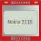

The Nokia 5110 is a basic graphic LCD screen for lots of applications.
<ln/>
The monochrome display has an 84 x 48 pixel resolution.

## Pin names

| Name | Description         |
| ---- | ------------------- |
| RST  | Reset pin           |
| CE   | Chip enable         |
| DC   | Data/Command select |
| DIN  | Serial data input   |
| CLK  | Serial clock input  |
| VCC  | Supply voltage      |
| BL   | Backlight control   |
| GND  | Ground              |

## Simulator examples
The example below uses the Adafruit PCD8544 library to control the display. The library provides a simple interface for drawing text, shapes and bitmaps on the screen:

- [Nokia 5011 example: Hello World](https://wokwi.com/projects/422590948073922561)
