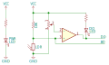

Photoresistor (LDR) sensor module

<wokwi-photoresistor-sensor />

## Pin names

| Name | Description           |
| ---- | --------------------- |
| VCC  | Positive power supply |
| GND  | Ground                |
| DO   | Digital output        |
| AO   | Analog output         |

## Attributes

| Name      | Description                           | Default value |
| --------- | ------------------------------------- | ------------- |
| lux       | Initial light value (lux)             | "500"         |
| threshold | Digital output threshold voltage      | "2.5"         |
| rl10      | LDR resistance @ 10lux (in kilo-ohms) | "50"          |
| gamma     | Slope of the log(R) / log(lux) graph  | "0.7"         |

## Operation

The photoresistor sensor module includes a LDR (light-dependant resistor) in series with a 10K resistor. The AO pin is connected between the LDR and the 10K resistor.

The voltage on the AO pin depends on the illumination - that is the amount of light that falls on the sensor. You can read this voltage by connecting the AO pin of the photoresistor sensor to an analog input pin and then using the `analogRead()` function.

There are two parameters that control the sensitivity of the LDR: rl10 and gamma. rl10 is the resistance of the LDR at illumination level of 10 lux. The gamma value determines the slope of the log(R) / log(lux) graph. You can usually find these two values in the datasheet of the LDR.

The following table shows the relationship between the illumination level (lux), resistance (R), and the voltage level
on the AO pin when gamma = 0.7 and rl10 = 50 (the default values):

| Condition            | Illumination (lux) | LDR Resistance | Voltage\* | analogRead() value |
| -------------------- | ------------------ | -------------- | --------- | ------------------ |
| Full moon            | 0.1                | 1.25MΩ         | 4.96      | 1016               |
| Deep twilight        | 1                  | 250kΩ          | 4.81      | 985                |
| Twilight             | 10                 | 50kΩ           | 4.17      | 853                |
| Computer monitor\*\* | 50                 | 16.2kΩ         | 3.09      | 633                |
| Stairway lighting    | 100                | 9.98kΩ         | 2.50      | 511                |
| Office lighting      | 400                | 3.78kΩ         | 1.37      | 281                |
| Overcast day         | 1,000              | 1.99kΩ         | 0.83      | 170                |
| Full daylight        | 10,000             | 397Ω           | 0.19      | 39                 |
| Direct sunlight      | 100,000            | 79Ω            | 0.04      | 8                  |

\* When VCC = 5V  
\*\* Measured one meter away from the monitor

The following code to convert the return value of `analogRead()` into a illumination value (in lux):

```cpp
// These constants should match the photoresistor's "gamma" and "rl10" attributes
const float GAMMA = 0.7;
const float RL10 = 50;

// Convert the analog value into lux value:
int analogValue = analogRead(A0);
float voltage = analogValue / 1024. * 5;
float resistance = 2000 * voltage / (1 - voltage / 5);
float lux = pow(RL10 * 1e3 * pow(10, GAMMA) / resistance, (1 / GAMMA));
```

### Digital output

The digital output ("DO") pin goes high when it's dark, and low when there's light. On the physical sensor, you tweak the small on-board potentiometer to set the threshold. In the simulator, use the "threshold" attribute to set the threshold voltage. The default threshold is 2.5 volts, or about 100 lux.

The bottom LED ("DO LED") is connected to the digital output, and lights whenever the DO pin goes low. In other words, it lights when the sensor is illuminated.

### Schematics



## Simulator examples

- [Photoresistor Digital Example](https://wokwi.com/projects/305193592908939842)
- [Photoresistor Analog Example](https://wokwi.com/projects/305193627138654786)
