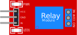

Electrically operated switch

## Pin names

| Name | Description                                 |
| ---- | ------------------------------------------- |
| VCC  | Supply voltage                              |
| GND  | Ground                                      |
| IN   | Control signal (e.g. from micro-controller) |
| NC   | Normally closed                             |
| COM  | Common pin                                  |
| NO   | Normally open                               |

## Attributes

| Name       | Description                               | Default value |
| ---------- | ----------------------------------------- | ------------- |
| transistor | "npn" (active-high) or "pnp" (active-low) | "npn"         |

## Operation

The relay is an electronic switch.

When the `IN` pin is high / disconnected, `COM` is connected to `NC` (NC means normally closed).

When the `IN` pin is low, `COM` is connected to `NO` (NO means normally open).

Setting the "transistor" attribute to "pnp" inverts the logic: when `IN` is high, `COM` is connected to `NO`, and when `IN` is low / disconnected, `COM` is connected to `NC`.

## Simulator Examples

- [One relay module controlling two LEDs](https://wokwi.com/projects/347308007359513172)
- [Arduino Uno controlling four relay modules](https://wokwi.com/projects/398166790321189889)
