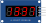

Seven segment LED display module with TM1637 4-wire interface

## Pin names

| Name | Description          |
| ---- | -------------------- |
| CLK  | Top segment          |
| DIO  | Top-right segment    |
| VCC  | Bottom-right segment |
| GND  | Bottom segment       |

## Attributes

| Name  | Description                   | Default value |
| ----- | ----------------------------- | ------------- |
| color | The color of the segment LEDs | "red"         |

## Using the 7-segment display

This variant of the seven segment display uses the TM1637 chip. You'll only need 2 microcontroller pins to communicate with it.

The TM1637 communication protocol is non-standard. It resembles the I2C protocol, but it is simpler and incompatible with I2C. Luckily, you can use a library and not worry about the implementation of the protocol. Here are some TM1637 libraries you can use on Arduino: [SevenSegmentTM1637@1.0.0](https://github.com/bremme/arduino-tm1637), Grove 4-Digit Display.

## Simulator examples

- [TM1637 Counter](https://wokwi.com/projects/339227323398095442)
- [TM1637 Clock](https://wokwi.com/projects/339227567530705492)
- [TM1637 Thermometer (MicroPython on Pi Pico)](https://wokwi.com/projects/339373435833549395)
