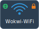

Simulated WiFi access point. Add one or more to your diagram to create custom WiFi networks for ESP32 projects.



:::note Paid Feature
Custom WiFi Access Points require a [Wokwi Hobby+ or Pro plan](https://wokwi.com/pricing?ref=docs_wifiap).
Free users can connect to the default **Wokwi-GUEST** open network.
:::

## Attributes

| Name     | Description                                 | Default value |
| -------- | ------------------------------------------- | ------------- |
| ssid     | Network name (SSID)                         | "MyNetwork"   |
| password | WPA2-PSK password (empty = open network)    | ""            |
| channel  | WiFi channel (1-13)                         | "6"           |
| internet | Internet access ("0" = disabled)             | "" (enabled)  |
| bssid    | MAC address (auto-generated if omitted)     | ""            |

### Examples

| Scenario     | Attrs                                                             |
| ------------ | ----------------------------------------------------------------- |
| Open network | `{ "ssid": "FreeWiFi" }`                                         |
| WPA2 secured | `{ "ssid": "HomeNet", "password": "secret123" }`                 |
| No internet   | `{ "ssid": "LocalOnly", "internet": "0" }`                      |

## Multiple access points

Add several `wokwi-wifi-ap` parts to simulate environments with multiple networks. This is useful for testing WiFi scanning and network selection UIs.

When the diagram contains custom WiFi access point parts, the default **Wokwi-GUEST** network is not created.

## Internet access

All access points provide internet access by default via the [Wokwi IoT Gateway](../guides/esp32-wifi#the-private-gateway). To create a local-only access point without internet routing, set the `internet` attribute to `"0"`.

## Connecting from Arduino

```cpp
#include <WiFi.h>

void setup() {
  Serial.begin(115200);
  WiFi.begin("HomeWiFi", "mypassword");
  while (WiFi.status() != WL_CONNECTED) {
    delay(100);
    Serial.print(".");
  }
  Serial.println("Connected!");
}
```

## Connecting from MicroPython

```python
import network
import time

sta_if = network.WLAN(network.STA_IF)
sta_if.active(True)
sta_if.connect('HomeWiFi', 'mypassword')
while not sta_if.isconnected():
    time.sleep(0.1)
print('Connected!')
```

## Simulator examples

- [Custom WiFi AP - Arduino](https://wokwi.com/projects/460381374437194753)
- [WiFi Network Scanner](https://wokwi.com/projects/460381185490070529)
