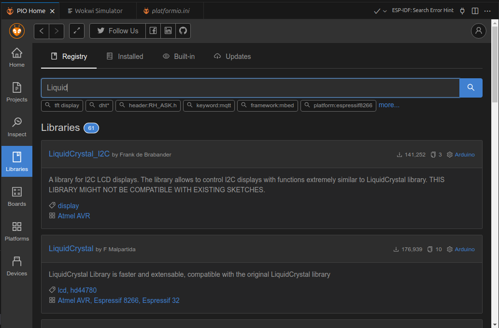
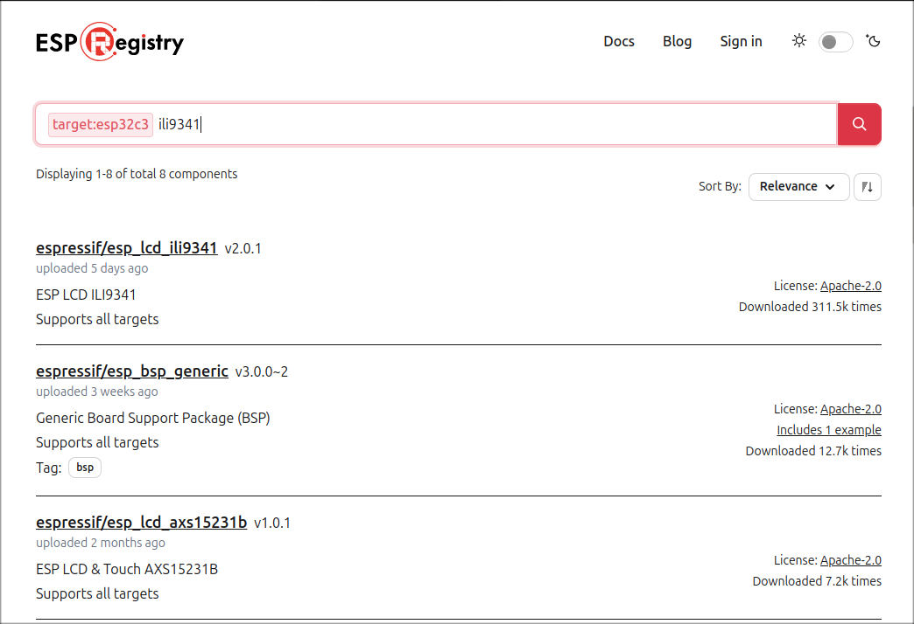
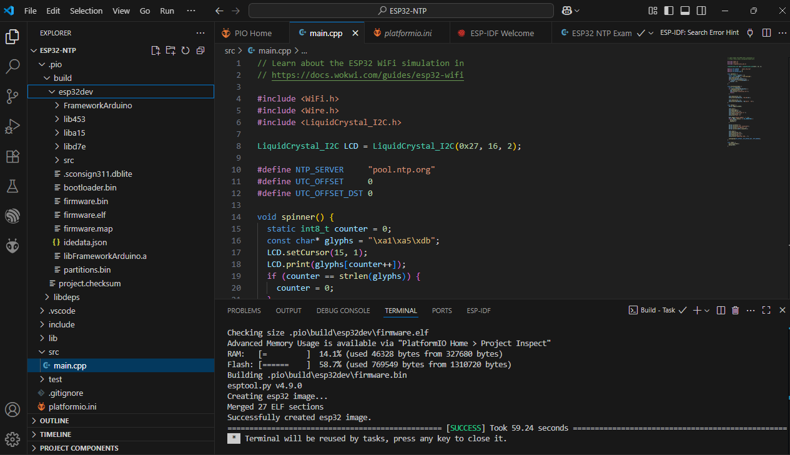
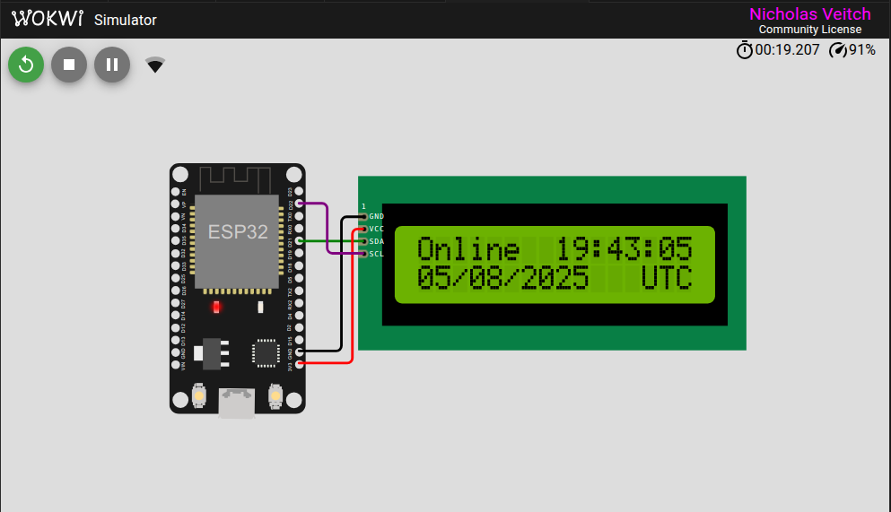

import Tabs from '@theme/Tabs';
import TabItem from '@theme/TabItem';

The web-based Wokwi simulator is a powerful and well-integrated way to try out your project designs: there are many capabilities which "just work" in the online simulator which will require some additional steps or workarounds to build and run locally.

This checklist of steps should help you overcome the most common issues. It is assumed that you have already installed the VS Code extension for Wokwi (see the [Getting started guide](./getting-started)).

:::tip

Using **MicroPython**? The setup for MicroPython projects is quite different - please see the [Vs Code for MicroPython page](vscode-micropython.md).
:::

## Download the project source

To start, the first step is to save your online project. From the same menu, under the save button, you can then select to download a `.zip` archive of the project. This will contain useful files such as any source code and the `diagram.json` file used by Wokwi.
Once downloaded you can extract the files from the archive and use them in your local project.

## Create an empty project in VS Code

If you are using an extension such as ESP-IDF or PlatformIO in VS Code, it is far easier to create an empty template project first before adding your Wokwi code. Use the provided templates for your chosen platform to create a new empty project. This will include specifying the hardware to be targeted and will create the required source structure and build files.

This step will create a boilerplate project in a working state, ready to add your own code.

## Add the source

Depending on the complexity of your project, adding the source should be quite straightforward.

<Tabs>
  <TabItem value="pio" label="PlatformIO" default>

    For a new PlatformIO Arduino project, the directory tree should look like this:

    ```text
    ├── .gitignore
    ├── include
    │   └── README
    ├── lib
    │   └── README
    ├── .pio
    │   └── build
    │       ├── project.checksum
    │       └── uno
    │           └── idedata.json
    ├── platformio.ini
    ├── src
    │   └── main.cpp
    ├── test
    │   └── README

    ```

    In this case you would delete the `/src/main.cpp`  and replace it with the '.ino' file from the project you downloaded.

    :::tip

    PlatformIO encourages the use of standard C++ files (`.cpp`). To convert your `.ino` file, you can rename it and change the extension to '.cpp', but you will also need to add a line to include the standard Arduino headers at the beginning of the file:
    ```
    #include <Arduino.h>
    ```
    Any user functions should also be declared before they are called. There is a more detailed example of this in the [PlatformIO documentation FAQ](https://docs.platformio.org/en/latest/faq/ino-to-cpp.html).

    :::
  </TabItem>
  <TabItem value="ESP-IDF" label="ESP-IDF">
    For ESP-IDF the default project directory tree looks like this:

    ```text
    ├── build
    │   ├── app-flash_args
    │   ├── bootloader
    │   ├── bootloader-flash_args
    │   ├── bootloader-prefix
    |   ...
    │   ├── cmake_install.cmake
    │   ├── compile_commands.json
    │   ├── config
    │   │   ├── kconfig_menus.json
    │   │   ├── sdkconfig.cmake
    │   │   ├── sdkconfig.h
    │   │   └── sdkconfig.json
    │   ├── config.env
    │   ├── esp-idf
    │   ...
    ├── CMakeLists.txt
    ├── main
    │   ├── CMakeLists.txt
    │   └── main.c
    ├── README.md
    └── sdkconfig
    ```
    :::note
    This is not the entire tree, as it is very large!
    :::

    The `build` directory is where the built artifacts will be created, which you will need to refer to in a later step.

    All of the source files should go in `main.c`. If you have multiple source files, you should also update the `CMakelists.txt` file in the same directory to include any other files which need to be built.
    
  </TabItem>
  <TabItem value="Zephyr" label="Zephyr">

  </TabItem>
</Tabs>  


## Verify/add libraries

If your project has used any additional libraries you may need to resolve them for your local build environment. The Wokwi online simulator includes access to a whole range of built-in and third party libraries which you may have added to your project - now your local build environment will also need them. It is usually better to use the library manager included with your build tools to ensure that you get an up to date and known working version of the library.

<Tabs>
  <TabItem value="pio" label="PlatformIO" default>
    If you are using PlatformIO in VS Code, many libraries are available in the Library Manager. Use the `libraries.txt` file downloaded with your project as a guide to the names of the libraries you need.

    The PlatformIO Library Manager has a search facility which will make this easier - just copy in the name of the library and hit search. Clicking on the 'Add' button will add the library to the `platformio.ini` file for each of the build targets you have configured.

    

    Note that many libraries have similar or sometimes even the same name.

  </TabItem>
  <TabItem value="ESP-IDF" label="ESP-IDF">
    If you are using the ESP-IDF extension for VS Code, libraries are managed as 'components'. A component is any modular code object compiled as a static library. The component library for ESP-IDF, much like the Library Manager in PlatformIO, contains many useful libraries maintained by Espressif, and tested third-party contributions.

    

  </TabItem>
  <TabItem value="Manual" label="Custom libraries">
    If the library you wish to use isn't available in the supported available libraries, you can add it manually. 
    
    For PlatformIO, the [library documentation](https://docs.platformio.org/en/latest/librarymanager/creating.html) will give further guidance.

    For ESP-IDF projects, custom libraries can be added as a component. Check out the [ESP-IDF project structure documentation](https://docs.espressif.com/projects/esp-idf/en/latest/esp32/api-guides/build-system.html#example-project) for more details.
  </TabItem>
</Tabs>

## Test the build tools

The Wokwi simulator requires a built firmware file to run, so the next step should be to check that you can generate one. Use the relevant build command from your chosen framework to build the files.

Check the terminal window output for any errors or warnings which you may want or need to correct.



## Add configuration

The online simulator controls its own build environment. To work locally in VS Code, you will need to provide an extra configuration file, `wokwi.toml`. This will not be part of the downloaded archive because Wokwi doesn't know what build tools or framework you will use for local VS Code development.

The structure and contents of the `wokwi.toml` file are covered in the [VS Code project configuration page](/vscode/project-config). In the previous step you already built the firmware files needed.

:::tip

You can also generate the `wokwi.toml` file using the Wokwi CLI if it is installed (see [install instructions here](/wokwi-ci/cli-installation)), by running the command:

```shell
wokwi-cli init
```
:::


At this point you should also add the `diagram.json` file from your downloaded project. This must be in the same directory as the `wokwi.toml` file.

## Test the simulator

When you select the `diagram.json` file in the VS Code editor, it will automatically open an embedded window with a graphical display showing the Wokwi circuit layout.



Use the start button in this window to start the simulation. The simulation should run exactly as it did in the online Wokwi simulator.

Note: You will need a license to edit the diagram in this view ([see the Wokwi pricing page](https://wokwi.com/pricing?ref=docs_migrating)).
