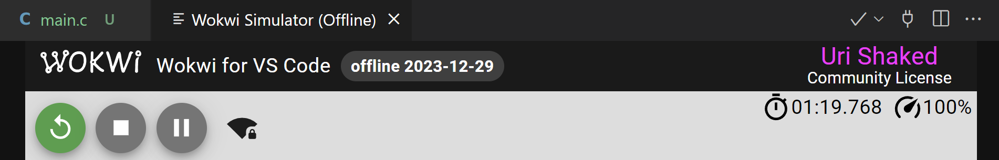

Wokwi for VS Code requires an internet connection to run. If you need to use Wokwi for VS Code in an environment without internet access, you can subscribe to the [Pro plan](https://wokwi.com/pricing).

When running in offline mode, the title of the simulator tab will be "Wokwi Simulator (Offline)", and the simulator will display the date when the simulation engine was last updated:

To update the simulator engine, go online and start the simulator. The simulator will automatically update the engine to the latest version, and will use it the next time you run the simulator in offline mode.

## Offline installation

If you need to install Wokwi for VS Code on a machine that does not have internet access, we can prepare a custom installation package for you. Please contact us to get a quote.
