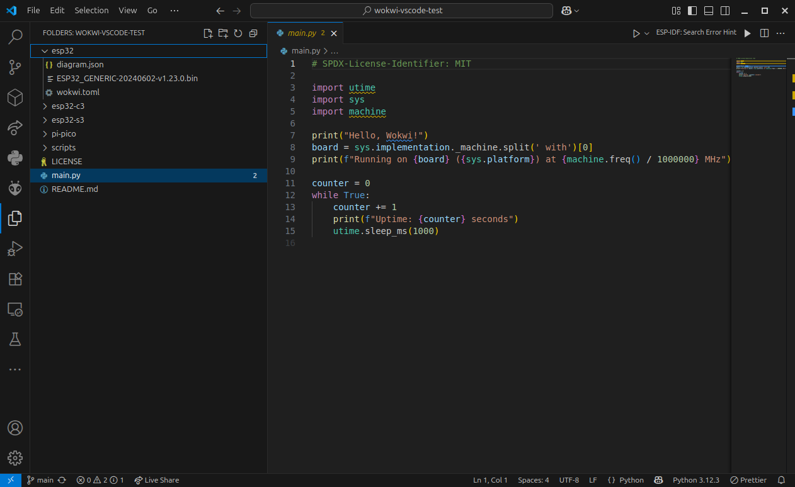
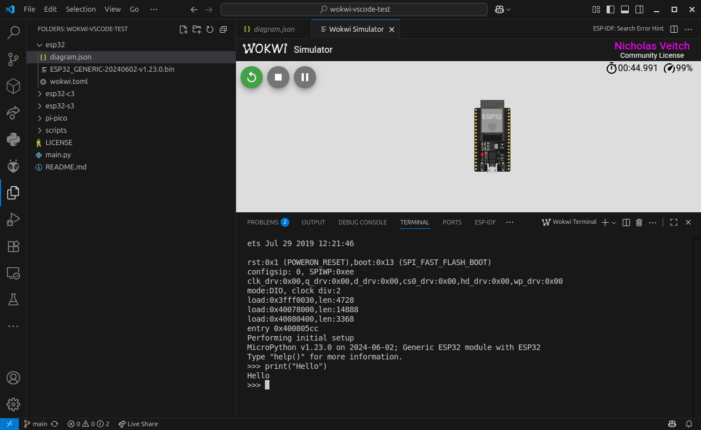
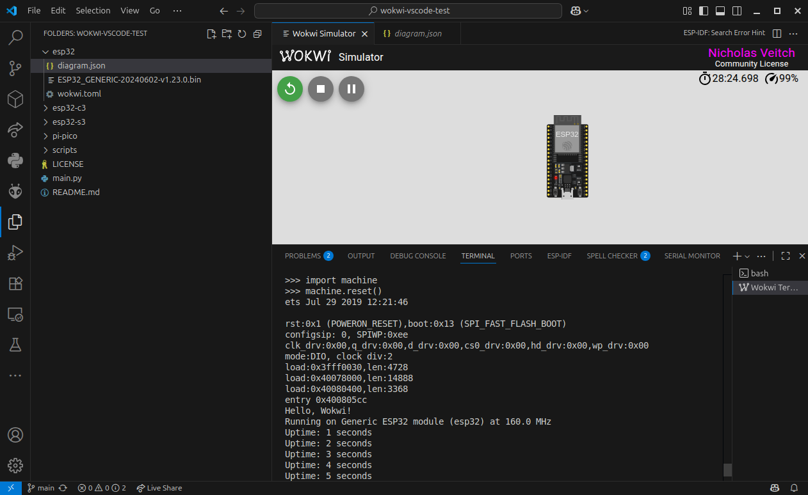

MicroPython projects differ from those in most of the other frameworks, because in this case the majority of the firmware to be installed on your hardware device (or Wokwi simulator) is MicroPython itself. This firmware, the `main.py` you create and any additional libraries are the components which need to be uploaded.
When the device or simulator is initialized or rebooted, it will first load MicroPython, then run the `main.py` code, and then (assuming the main code exits) respond to further interaction using the [REPL](https://docs.micropython.org/en/latest/esp8266/tutorial/repl.html) prompt.
In the case of the Wokwi simulator, this means, in addition to the code you have created, it also requires a version of the firmware to run the simulation on.

## Before you start

There are three things you should install before migrating your project to VS Code (or starting a new one).

1. Make sure you have the VS Code extension for Wokwi (See the [getting started guide](./getting-started#installation)).
1. Install the **mpremote** software (see the [MicroPython documentation](https://docs.micropython.org/en/latest/reference/mpremote.html) for this step). This software uses a serial connection to your MicroPython-enabled hardware (or the Wokwi simulator) to manage the filesystem and perform tasks such as rebooting or entering the REPL interactive mode.
   :::warning
   To avoid compatibility issues, it is strongly advised to install **a version of mpremote of the same version as your firmware**. The default firmware in the project repository is currently `1.23`. To install the matching mpremote with `pip` for example:

   ```bash
   pip install mpremote==1.23
   ```

   ...or adjust for whatever method you are using for installing `mpremote`.
   :::
1. Clone the [example project from GitHub](https://github.com/wokwi/wokwi-vscode-micropython). This project has been set up with the relevant files that the Wokwi simulator requires for different types of hardware. You can visit the link to clone or download the repository, or [download it via this link](https://github.com/wokwi/wokwi-vscode-micropython/archive/refs/heads/main.zip) as a zip file. Remember to uncompress the file somewhere you want to work with it!

## Open the repository in Visual Studio Code

Run Visual Studio Code and then use 'File>Open folder' to open the directory containing the example project.
You'll find the project contains a useful README, a `main.py` file and some hardware specific directories (`esp32`, `rp2040`, and so on, for different microcontrollers).



Each of the hardware directories contains the relevant firmware file for MicroPython, a Wokwi `diagram.json` file and the `wokwi.toml` file used to configure the simulator.

Select the `diagram.json` file, and a new view should open showing a board and the familiar Wokwi simulation display. Click on the play button to run the simulation and test that it works.



Once the simulator starts, it will also open a terminal window which will show the startup messages and then start the interactive REPL. You can enter MicroPython commands here to further test the simulation.

What you may have noticed is that it didn't execute the code in `main.py`. That's because the local version of `main.py` hasn't been uploaded to the filesystem of MicroPython in the simulator - it's just running the bare MicroPython firmware.

## (Optional) Add your own files

If you have downloaded a MicroPython project from the Wokwi online simulator, you should add these files to the project, replacing the default files. The download will contain at a minimum the `main.py` file and a `diagram.json` file.

Replace `main.py` in the main directory of the project with your own. If you used any additional files (for example, extra python modules or data files), these should also be added here.

The `diagram.json` file needs to be in the hardware specific directories. Copy it into each of the hardware directories (or just the ones you intend to use).

You can select the `diagram.json` file again to open the simulator and confirm that your circuit is displayed.

## Uploading files to the Wokwi simulator

Before we can upload anything, we need to start the simulation. When it's running, Wokwi also opens a serial connection through a server on a local port. We can then use this connection to upload the files.

:::note
The serial port configuration for the simulator can be found in the `wokwi.toml` file in eache hardware specific directory:
```
rfc2217ServerPort = 4000
```
This designates port '4000' for the connection. You may wish to change this if you have other services already using this port.  
:::

To upload the `main.py` file, open a new terminal (you can add an additional terminal within VS Code and switch between it and the Wokwi REPL) and enter the command to upload the `main.py` file:

```
mpremote connect port:rfc2217://localhost:4000 fs cp main.py :main.py 
```

:::note
Sometimes the command will return an error which ends with `TransportError("could not enter raw repl")`. If you get this error you can force the REPL into 'Raw' mode by activating the Wokwi REPL window and pressing <kbd>Ctrl</kbd> + <kbd>A</kbd>, then go back to your terminal and run the command again.
:::

:::tip
On Unix based systems (e.g. Mac or Linux), you can create a shortcut for connecting to the simulator by running the following command:
```
mkdir -p ~/.config/mpremote
echo 'config={"wokwi": "connect port:rfc2217://localhost:4000"}' > ~/.config/mpremote/config.py
```
After running this command, you can connect to the simulator by running `mpremote wokwi`.
:::

You can also use `mpremote` to install libraries which are part of the MicroPython `mip` package library. For example, to install the `ssd1306` library:

```
mpremote connect port:rfc2217://localhost:4000 mip install ssd1306
```

For your own additional files, simply upload with the syntax:

```
mpremote connect port:rfc2217://localhost:4000 fs cp <filename> :<filename>
```

You can confirm what files have been uploaded with the `ls` command:

```
 mpremote connect port:rfc2217://localhost:4000 ls
```

Once the required files are uploaded, you can either perform a hard reset of the device by accessing the REPL and entering:
```python
import machine
machine.reset()
```

Or issue <kbd>Ctrl</kbd> + <kbd>D</kbd> in the REPL, which will perform a soft reset.

In both instances, `main.py` will begin running automatically after the device finishes booting.

If using the `soft-reboot` command provided by `mpremote`, `main.py` will not begin running automatically - you will have to connect
to the device and specify for it to run the file.



:::warning
The filesystem stored in the simulator is not persistent. If you stop the simulation or close the simulation window in VS Code, you will need to repeat the steps to upload any files or libraries again.
:::