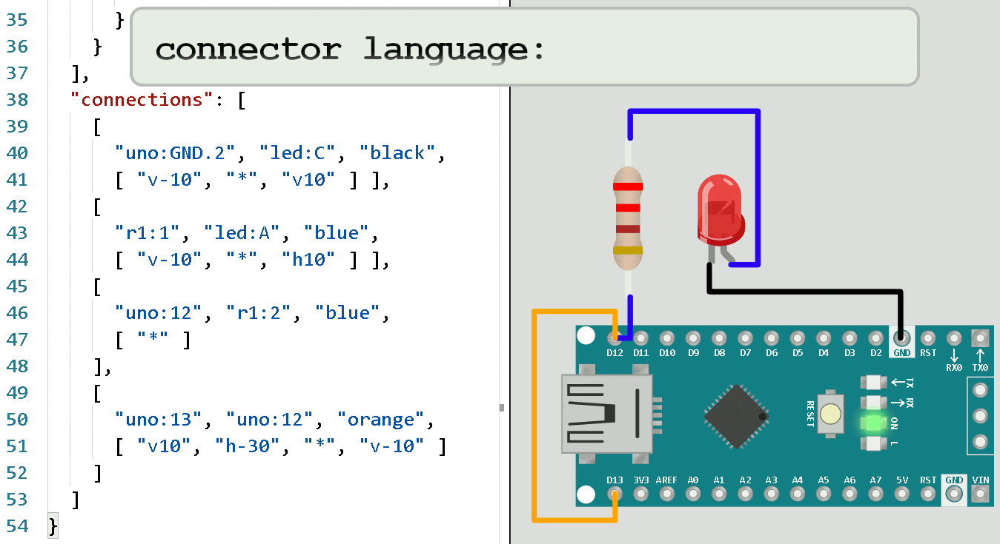

Cada projeto de simulação contém um arquivo diagram.json. Este arquivo define os componentes
que serão usados para a simulação, suas propriedades e as conexões entre os componentes.

## Estrutura do arquivo

O arquivo de diagrama é um arquivo JSON com várias seções. A estrutura básica do arquivo é tão
segue:

```json
{
  "version": 1,
  "author": "Uri Shaked",
  "editor": "wokwi",
  "parts": [],
  "connections": []
}
```

`"version"` é sempre 1, `"author"` é o nome da pessoa que criou o
arquivo, e `"editor"` é o nome do aplicativo que foi usado para editar o
arquivo ("wokwi").

## Componentes

As seção `"parts"` define a lista de componentes da simulação.
É uma matriz de objetos com as seguintes chaves:

| Nome   | Tipo    | Descrição                                       |
| ------ | ------- | ----------------------------------------------- |
| id     | string  | o identificador único da peça (e.g. "led1")     |
| type   | string  | o tipo do componente (e.g. "wokwi-led")         |
| left   | number  | coordenada x da tela (em pixels)                |
| top    | number  | coordenada y da tela (em pixels)                |
| attrs  | object  | atributos do componente (ex: "color")           |
| rotate | number  | rotação em decréscimo (ex: 90)                  |
| hide   | boolean | se for true, o componente não será visível      |

`id` e `type` são obrigatórios, os outros campos são opcionais.

Por exemplo, aqui está como você define um LED vermelho chamado `"led1"` na posição (x=100, y=50):

```json
{
  "id": "led1",
  "type": "wokwi-led",
  "left": 100,
  "top": 50,
  "attrs": {
    "color": "red"
  }
}
```

:::warning
Cada componente deve ter uma única propriedade "id". Se dois componentes têm o mesmo "id",
a simulação pode não funcionar corretamente.
:::

Uma lista parcial do tipo do componente (ex: `wokwi-led`) está disponível em [Wokwi Elements](https://elements.wokwi.com).
Uma lista completa aparecerá aqui algum dia.

:::tip
Em vez de especificar manualmente as coordenadas esquerda/superior para cada item, você
pode arrastá-los com o mouse para a posição desejada.
:::

## Conexões

A seção `"connections"` define como os componentes são conectados. Cada conexão é uma matriz com quatro
elementos:

- O ID do componente de origem e o nome do pino, separados por dois pontos. ex: `partId:pinName`
- A identificação do componente de destino e o nome do pino
- A cor do fio (ou uma string vazia para esconder o fio)
- Uma lista de instruções sobre como colocar o fio, como uma matriz de strings (opcional)

Por exemplo, a seguinte definição conectará o pino A (ânodo) do `led1`
ao pino 13 do Arduino `uno`:

```json
  ["led1:A", "uno:13", "green", []],
```

Você pode encontrar o nome de um pino do componente movendo o mouse sobre ele.

### Mini linguagem de colocação de fios

Cada elemento na seção `"connections"` pode especificar uma lista de instruções
como desenhar as linhas para o fio. Os fios sempre vão em linha reta, também
horizontalmente ou verticalmente, e nunca diagonalmente.

Existem três instruções:

- "v" seguido por um número de pixels: move verticalmente (acima/abaixo)
- "h" seguido por um número de pixels: move horizontalmente (esquerda/direita)
- "\*" pode aparecer apenas uma vez. Todas as instruções que aparecem antes do "\*"
  se aplicam ao pino de origem, e as instruções que aparecem após se aplicam
  aos pinos de destino.

Por exemplo:

```json
["v10", "h5", "*", "v-15", "h10"]
```

O "v10" será movido 10 pixels para baixo do pino de origem, então "h5" se moverá
cinco pixels para a direita.

As instruções que aparecem após o "\*" são aplicados na ordem inversa: "h10" Irá
mover 10 pixels para a direita do pino de destino, então "v-15" moverá 15 pixels para cima.

Finalmente, o simulador conectará as duas extremidades do fio com uma combinação
de um fio horizontal e um vertical que cobrem a distância restante, conforme necessário.

### Animação de colocação de fios

Se você é um aprendiz visual, pode achar útil a seguinte animação GIF.
A animação foi criada por Steve Sigma.


