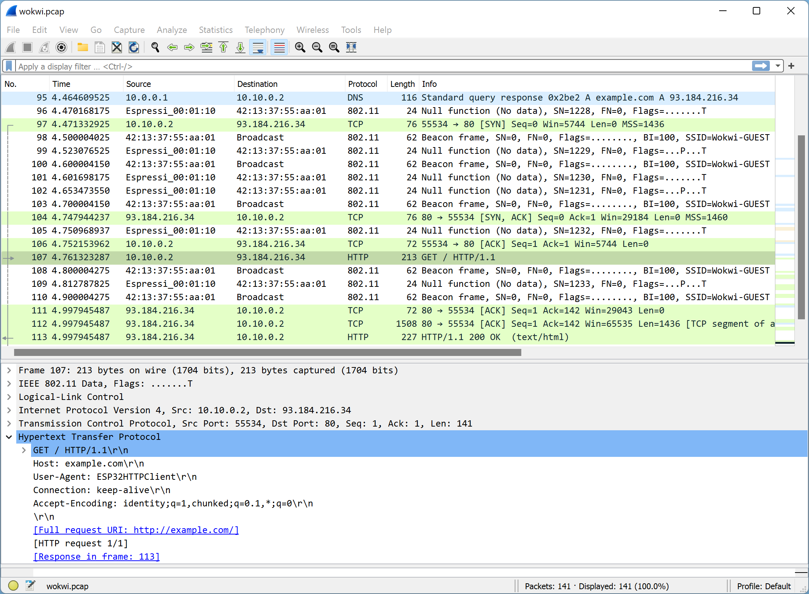

Wokwi simula uma rede WiFi com acesso total à Internet. Você pode usar o [ESP32](./esp32) juntamente com o WiFi virtual para prototipar projetos de IoT. Os casos de uso comuns incluem:

- Conecte-se a servidores MQTT para enviar dados do sensor
- Consultar serviços da web por HTTP, HTTPS e web sockets
- Execute um servidor HTTP dentro do ESP32 e conecte-se a ele a partir do seu navegador (requer o [Wokwi IoT Gateway](#o-gateway-privado))

## Conectando-se ao Wi-Fi

O simulador fornece um ponto de acesso WiFi virtual chamado **Wokwi-GUEST**. É um ponto de acesso aberto - nenhuma senha é necessária.

### Conectando do Arduino

Para conectar a partir do dispositivo Arduino (em um ESP32), use o seguinte código:

```cpp
#include <WiFi.h>

void setup() {
  Serial.begin(9600);
  Serial.print("Conectando-se ao Wi-Fi");
  WiFi.begin("Wokwi-GUEST", "", 6);
  while (WiFi.status() != WL_CONNECTED) {
    delay(100);
    Serial.print(".");
  }
  Serial.println(" Conectado!");
}

void loop() {
  delay(100); // TODO: Construa algo incrível!
}
```

Nota: Especificamos o número (6) do canal WiFi ao chamar `WiFi.begin()`. Isto pula a fase de varredura do WiFi e economiza cerca de 4 segundos ao se conectar ao WiFi.

### Conectando do MicroPython

Para conectar de um [projeto MicroPython](https://wokwi.com/projects/new/micropython-esp32), use o seguinte código:

```python
import network
import time

print("Conectando-se ao Wi-Fi", end="")
sta_if = network.WLAN(network.STA_IF)
sta_if.active(True)
sta_if.connect('Wokwi-GUEST', '')
while not sta_if.isconnected():
  print(".", end="")
  time.sleep(0.1)
print(" Conectado!")
```

Uma vez conectado, você pode usar a [urequests library](https://mpython.readthedocs.io/en/master/library/mPython/urequests.html) para enviar solicitações HTTP e HTTPS, e o [umqtt library](https://mpython.readthedocs.io/en/master/library/mPython/umqtt.simple.html) para estabelecer conexões MQTT.

## Acesso à Internet

Wokwi usa um gateway especial para conectar seu ESP32 simulado à internet. Este gateway é necessário, pois o navegador da Web não permite acesso direto à Internet. Há duas maneiras de usar o Wokwi IoT Gateway: o gateway público e o gateway privado.

|                      | Gateway Publico       | Gateway Privado                                             |
| -------------------- | --------------------- | ----------------------------------------------------------- |
| Velocidade           | Mais devagar          | Mais rápido                                                 |
| Estabilidade         | Média                 | Alta                                                        |
| Localização          | Remoto, na nuvem      | Funciona no seu computador                                  |
| Privacidade          | Conexões monitoradas  | Sem monitoramento                                           |
| Conexões de saída    | ✅                    | ✅                                                          |
| Conexões de entrada  | ❌                    | ✅                                                          |
| Disponibilidade      | Todos os usuários     | Apenas para membros do [Club](../getting-started/wokwi-club) |

### O Gateway Publico

O Gateway é o método de conexão com a Internet padrão. Funciona imediatamente e permite o acesso à Internet, mas não à sua rede local. Todo o tráfego é monitorado para fins de segurança, portanto, **não o use** para dados privados ou confidenciais. Ocasionalmente, inspecionamos o tráfego e podemos impor limites se notarmos uso excessivo do gateway.

O Gateway Público é uma ótima opção para brincar e aprender sobre WiFi e rede no ESP32.

### O Gateway Privado

O Gateway Privado é um pequeno aplicativo que você baixa e executa em seu computador. Permite acesso à internet ESP32 mais rápido e robusto: os dados vão direto do simulador (rodando no seu navegador) para a rede do seu computador, sem precisar passar pela nuvem. Isso significa:

- Não há monitoramento. Seu tráfego permanece privado.
- Seus projetos ESP32 podem acessar serviços executados em seu computador ou em sua rede local (por exemplo, um servidor MQTT ou HTTP local)
- Você pode executar um servidor web no ESP32 e conectar-se a ele a partir do seu navegador (explicado abaixo)

O Gateway Privado está disponível apenas para usuários que ingressam [no Wokwi Club](../getting-started/wokwi-club).

#### Instalação

Baixe a versão mais recente na [página de releases do Wokwi IoT Gateway](https://github.com/wokwi/wokwigw/releases/latest). Você verá as versões para Windows, macOS e Linux. Em seguida, extraia o arquivo ZIP e execute o arquivo executável dentro dele. Seu navegador / sistema operacional pode avisá-lo de que o arquivo pode não ser seguro, então você terá que dizer a eles para executá-lo de qualquer maneira.

O gateway _não_ requer permissões de administrador/raiz. Felizmente, ele é executado como um processo padrão em seu computador.

Quando você executa o gateway, ele deve imprimir um logotipo, sua versão e dizer: "Listening on TCP port 9011". Viva, você concluiu a configuração!

Se você está preocupado em executar o executável do gateway em seu computador, você está convidado a dar uma olhada no [código-fonte](https://github.com/wokwi/wokwigw) e até mesmo construir o arquivo executável você mesmo (peça instruções sobre no [discord](https://wokwi.com/discord)).

#### Uso Básico

Após executar o gateway, abra qualquer projeto no Wokwi, vá até o editor de código, pressione "F1" e selecione "Enable Private Wokwi IoT Gateway". Você será perguntado se deseja habilitar o gateway. Responda "OK" para habilitar o Gateway Privado ou "Cancelar" para desativá-lo e voltar para o Gateway Público.

Em seguida, execute qualquer projeto ESP32 que use o WiFi. Olhe para a saída do gateway, deve dizer "Client connected". Isso significa que você está usando o Gateway Privado.

Se o seu projeto ESP32 for um servidor HTTP, você pode se conectar a ele a partir do seu navegador em [http://localhost:9080/](http://localhost:9080). A conexão será encaminhada pelo gateway para a porta HTTP padrão (80) no ESP32 simulado. Se você precisar encaminhar portas diferentes, por favor [abra uma issue no Github](https://github.com/wokwi/wokwigw/issues/new).

Nota: O gateway de IoT privado não tem suporte no momento ao Safari devido a [uma limitação técnica](https://bugs.webkit.org/show_bug.cgi?id=171934#c96). Use um navegador diferente (por exemplo, Chrome, Firefox, Edge).

## Uso Avançado

### Endereços de rede

O ESP32 obtém um endereço IP de um servidor DHCP executado dentro do Wokwi IoT gateway. O endereço IP depende do tipo de gateway que você usa:

- Gateway Público: 10.10.0.2
- Gateway Privado: 10.13.37.2

O endereço MAC do ESP32 simulado é 24:0a:c4:00:01:10.
O BSSID do ponto de acesso virtual ("Wokwi-GUEST") é 42:13:37:55:aa:01, e está ouvindo no canal 6 do WiFi.

### Visualizando o tráfego WiFi com o Wireshark

O Wokwi simula uma pilha de rede completa: começando na camada MAC 802.11 mais baixa, passando pelas camadas IP e TCP/UDP, até protocolos como DNS, HTTP, MQTT, CoAP, etc. Use um analisador de protocolo de rede, como [Wireshark](https://www.wireshark.org).

Primeiro, execute um projeto ESP32 que use o WiFi no simulador. Em seguida, vá para o editor de código, pressione F1 e escolha **Download WiFi Packet Capture (PCAP) file**. Seu navegador baixará um arquivo chamado _wokwi.pcap_. Use o Wireshark para abrir este arquivo.

A captura de tela a seguir mostra um exemplo de captura de pacote de solicitação HTTP:



Como você pode ver, o arquivo PCAP contém todos os tipos de pacotes: quadros de beacon 802.11, resposta de consulta DNS (a primeira entrada na lista) e pacotes de solicitação/resposta HTTP (nº 107 e 113).

Na maioria dos casos, você desejará se concentrar apenas em um protocolo específico. Você pode conseguir isso pressionando Ctrl+/ no wireshark e digitando um nome de protocolo (http, tcp, ip, dns, dhcp, etc.). Isso irá filtrar a lista e exibir apenas os pacotes relevantes.

:::caution::atenção
O campo Time na captura de pacotes usa o tempo do relógio de simulação. Pode avançar mais devagar que o relógio de parede se a simulação estiver rodando mais devagar que a velocidade máxima (100%).
:::

### Limitações

O Wokwi IoT Gateway suporta TCP e UDP. Ele não suporta o protocolo ICMP, portanto, a funcionalidade Ping não está disponível.

## Exemplos no simulador

- [Cliente NTP](https://wokwi.com/projects/321525495180034642) - Obtém a data e hora atuais de um servidor NTP e as exibe em uma tela LCD.
- [Logger Climático MicroPython MQTT](https://wokwi.com/projects/322577683855704658) - Lê a temperatura atual + umidade a cada segundo e relata as alterações para um servidor MQTT.
- [Servidor HTTP ESP32](https://wokwi.com/projects/320964045035274834) - Servidor de uma página web que controla 2 LEDs. Requer o [Wokwi IoT Gateway](#the-private-gateway).
