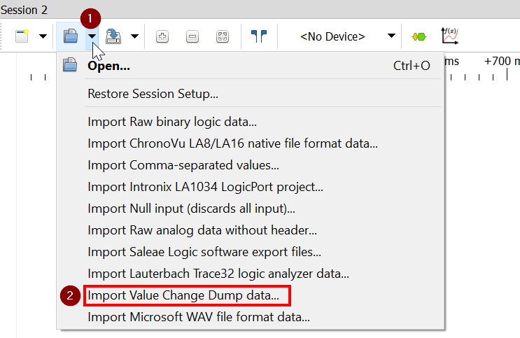
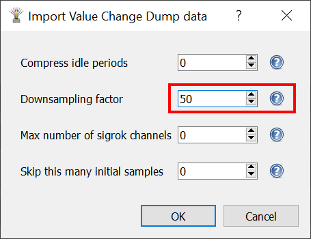

import LogicAnalyzerI2CImage from './logic-analyzer-i2c-decoder.png';

O [Analisador Lógico Wokwi](../parts/wokwi-logic-analyzer) registra os valores dos sinais digitais do seu projeto. É uma ferramenta de depuração poderosa e pode ajudá-lo a diagnosticar problemas em seu circuito e código. Também é muito útil para auxiliar no processo de aprendizagem.

Alguns casos de uso incluem:

- Observar o sinal de PWM gerado pela [função analogWrite()](https://www.arduino.cc/reference/pt/language/functions/analog-io/analogwrite/)
- Analisar o sinal de controle de um [Motor Micro Servo](../parts/wokwi-servo)
- Desenvolver e depurar máquinas de estado (PIO) para o [Raspberry Pi Pico](../parts/wokwi-pi-pico)
- Aprender sobre o protocolo I2C observando os sinais SCL/SDA

<figure>
  
  <figcaption>Analisador Lógico: sinais do protocolo I2C decodificados no PulseView</figcaption>
</figure>

## Características

O Analisador Lógico Wokwi possui 8 canais digitais, chamados D0 a D7. Ele tem uma taxa de amostragem de 1 GHz, que deve ser mais do que suficiente para a maioria das aplicações.

Cada canal possui um LED de atividade que fica verde sempre que há uma atividade no canal. Os LEDs de atividade fornecem uma maneira fácil de ver se os sinais estão conectados corretamente.

Também possui um pequeno display, onde mostra o número de amostras capturadas desde o inicio da simulação.

O [acionamento configurável](#usando-o-acionamento) permite registrar apenas parte dos dados. Por exemplo, você pode iniciar a gravação ao pressionar o botão ou gravar apenas enquanto a comunicação SPI estiver ativa (usando o pino SS como um acionamento).

## Usando o Analisador Lógico

Primeiro, adicione o Analisador Lógico ao seu projeto. Você pode fazer isso clicando no botão de adição roxo e selecionando "Logic Analyzer (8 channels)".

Em seguida, conecte os sinais que deseja gravar aos pinos do Analisador Lógico. Por exemplo, se você deseja gravar a comunicação I2C entre um Arduino Uno e alguns periférico (como o [DS1307 RTC](../parts/wokwi-ds1307)), você pode conectar os pinos A4/A5 (que transportam os sinais SDA/SCL) aos pinos D0/D1 do Analisador Lógico.

Inicie a simulação. Você deve ver os LEDs verdes em atividade piscando conforme os sinais estão chegando, e o número de amostras aparecerão acumuladas.

Para visualizar a captura, pare a simulação. Isso baixará um arquivo chamado "wokwi-logic.vcd" para o seu computador. O arquivo contém os sinais gravados no formato [Value Change Dump](https://en.wikipedia.org/wiki/Value_change_dump).

Você pode usar um software como o PulseView ou GTKWave para abrir e visualizar os arquivos de captura. Esse software também inclui analisadores de protocolo poderosos que podem decodificar muitos protocolos comuns, como UART, I2C, WS2812 e muitos outros.

### Usando o Acionamento

Por padrão, o analisador lógico registra dados para toda a duração da simulação. O acionamento permite controlar a gravação de dados, definindo o valor de um dos pinos de entrada do analisador digital (D7 por padrão).

Aqui estão alguns exemplos de casos de uso comuns:

- [Inicia a gravação quando um botão for pressionado](https://wokwi.com/projects/313698551063380544) - Define o `triggerMode` como "edge" e conecta o pino do acionamento (D7) ao aterramento por meio de um resitor pull-down. Conecta a outra extremidade do botão à fonte de alimentação positiva (VCC/5V).
- [Grava apenas enquanto o botão é pressionado](https://wokwi.com/projects/313706149095408193) - Mesma configuração que acima, mas o `triggerMode` está definido para "level".
- [Inicia a gravação após 1,5 segundos](https://wokwi.com/projects/313706408220557888) - Define `triggerMode` como "edge", conecta o pino de disparo (D7) e altera o nível do pino para alto após 1,5 segundos.

Use os atributos `triggerPin` e `triggerLevel` para configurar o pino de acionamento e definir o nível de disparo ("alto" ou "baixo"). Verifique a [documentação do Analisador Lógico Wokwi](../parts/wokwi-logic-analyzer) para obter mais informações.

### Visualizando os dados no PulseView

PulseView é uma GUI de código aberto que suporta Analisadores Lógicos. Ele roda em Linux, Windows, Mac OS X e há até uma versão para Android. Você pode visitar a [página de downloads](https://sigrok.org/wiki/Downloads) para obter a última versão.

Carregue o arquivo de sinal gravado (VCD) clicando na pequena seta ao lado do botão "Open" e selecione a opção: "Import Value Change Dump data..."



Você verá uma caixa de diálogo onde pode escolher o arquivo VCD a ser importado. Depois de selecionar um arquivo, haverá outra caixa de diálogo com as opções de importação:



Infelizmente, as opções padrão geralmente fazem com que o PulseView consuma muita memória RAM e fique lento. Você pode reduzir o uso de memória definindo um valor em **Downsampling factor** (Fator de redução da resolução). Um valor de **50** deve funcionar para a maioria dos casos de uso. A tabela a seguir mostra alguns valores comuns:

| Downsampling factor | Taxa de amostragem | Quando usar?                                                       |
| ------------------- | ------------------ | ------------------------------------------------------------------ |
| 1000                | 1MHz               | Sinais de baixa frequência / gravações longas (mais de 10 minutos) |
| **50**              | **20MHz**          | Sinais comuns (UART, I2C, LED PWM, WS2812, etc.)                   |
| 10                  | 100MHz             | Sinais de velocidade alta (10MHz+)                                 |
| 1                   | 1GHz               | Sinais de velocidade muito alta (50MHz+)                           |

Após confirmar as opções de importação, você deverá ver os sinais importados na tela. Os nomes dos sinais serão "logic.D0", "logic.D1", etc.

Para saber mais sobre como usar o PulseView, consulte o [manual do usuário do PulseView](https://sigrok.org/doc/pulseview/unstable/manual.html).

#### Configurando o Windows para abrir arquivos VCD no PulseView

Você pode configurar o Windows para abrir automaticamente arquivos VCD no PulseView. Abra uma janela do Prompt de Comando (cmd) **como administrador** e digite os seguintes comandos:

```
ftype vcdfile="%ProgramFiles%\sigrok\PulseView\pulseview.exe" "-I" "vcd:downsample=50" "%1"
assoc .vcd=vcdfile
```

Observe que esses comandos não funcionam no PowerShell. Funciona apenas no Prompt de Comando (cmd) com privilégios de administrador. O comando define o fator de redução da resolução para 50, mas você pode escolher um valor diferente que se adapte às suas necessidades (consulte a tabela acima).

### Visualizando os dados no GTKWave

[GTKWave](http://gtkwave.sourceforge.net/) é um software multiplataforma de visualização de ondas de código aberto. GTKWave pode abrir arquivos VCD gerados pelo Wokwi Logic Analyzer.

O [wokwi2gtkwave Python script](https://github.com/bvandepo/wokwi2gtkwave) é um projeto contribuído por um usuário de automação para usar o GTKWave com Wokwi: ele pode monitorar seu diretório de downloads e abrir automaticamente novos arquivos com GTKWave. O script também configura GTKWave para exibir automaticamente os sinais de seus arquivos VCD e ampliá-los para caber na tela.
