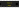

Registrador de deslocamento (shift register) de 8 bits Serial-In Parallel-Out (SIPO)



Use o registrador de deslocamento 74HC595 para expandir o número de pinos de _output_ em seu microcontrolador. Para registro de deslocamento de entrada (por exemplo, leitura de vários botões com um único pino de entrada), consulte o [wokwi-74hc165](wokwi-74hc165).

## Nome dos Pinos

| Pino  | Descrição                                                         |
| ----- | ----------------------------------------------------------------- |
| DS    | Entrada serial                                                    |
| SHCP  | Clock serial                                                      |
| STCP  | Pino de armazenamento (latch)                                     |
| OE    | Saída habilitada, ativo em baixo. Conecte ao GND se não for usado |
| Q0…Q7 | Saída paralela                                                    |
| Q7S   | Saída serial\*                                                    |
| MR    | Reset (clear), ativo em baixo. Conecte ao VCC se não for usado    |
| GND   | Terra                                                             |
| VCC   | Tensão de alimentação                                             |

\* Use o Q7S para encadear várias unidades 74HC595 juntas. Conecte o Q7S ao pino DS do próximo chip 74HC595 na cadeia.

## Conectando ao Arduino

Você precisará conectar pelo menos 3 pinos ao seu microcontrolador: DS, SHCP e STCP.

O pino OE pode ser usado para desabilitar a saída do registrador de deslocamento. Se você precisa dessa funcionalidade,
conecte-o ao seu microcontrolador. Caso contrário, conecte-o ao terra para habilitar a saída permanentemente.

Os pinos de saída do registrador de deslocamento, Q0 a Q7, são geralmente conectados em [LEDs](wokwi-led) ou um display de 7 segmentos.

O exemplo de código a seguir assume que você conectou DS ao Arduino pino 2, SHCP ao Arduino pino 3 e
STCP para o pino 4 do Arduino. Ele produz um padrão de 8 bits que se inverte duas vezes por segundo:

```cpp
const int dataPin = 2;   /* DS */
const int clockPin = 3;  /* SHCP */
const int latchPin = 4;  /* STCP */

void setup() {
  pinMode(dataPin, OUTPUT);
  pinMode(clockPin, OUTPUT);
  pinMode(latchPin, OUTPUT);
}

int pattern = 0b10101010;
void loop() {
  digitalWrite(latchPin, LOW);
  shiftOut(dataPin, clockPin, LSBFIRST, pattern);
  digitalWrite(latchPin, HIGH);
  delay(500);
  pattern = ~pattern; // Inverte o padrão
}
```

Você também pode [executar este exemplo no Wokwi](https://wokwi.com/projects/301192672203244042).

## Exemplos no simulador

- [75HC595 shift register com 8 LEDs](https://wokwi.com/projects/301188813482361352)
- [Arduino 16-LED shift register blink](https://wokwi.com/projects/301213976182653448)
- [ATtiny85 75HC595 clock](https://wokwi.com/projects/301366580039647753)
- [8-digit seven-segment hex counter](https://wokwi.com/projects/301304715310793225)
