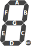

Display de LED 7 segmentos

<wokwi-7segment />

## Nome dos Pinos

| Nome | Descrição                       |
| ---- | ------------------------------- |
| A    | Segmento superior               |
| B    | Segmento superior direito       |
| C    | Segmento inferior direito       |
| D    | Segmento inferior               |
| E    | Segmento inferior esquerdo      |
| F    | Segmento superior esquerdo      |
| G    | Segmento do meio                |
| DP   | Ponto do LED                    |
| COM  | Pino comum\*                    |
| DIG1 | Pino do dígito 1\*              |
| DIG2 | Pino do dígito 2\*              |
| DIG3 | Pino do dígito 3\*              |
| DIG4 | Pino do dígito 4\*              |
| CLN  | Pino dos dois pontos (opcional) |

\* COM é o pino comum para um display de 7 segmentos de um único dígito. Para um display de vários dígitos, use DIG1…DIG4.

Por padrão, os pinos do segmento (A…G, DP, CLN) são conectados ao ânodo (lado positivo) dos LEDS, e o
pinos comuns (COM, DIG1…DIG4) são conectados ao cátodo (lado negativo) dos LEDs. Você pode definir o "comum"
atribuído ao "cátodo" para reverter esse comportamento.

O mapeamento do segmento é o seguinte:

E o mapeamento de dígitos:

## Atributos

| Nome   | Descrição                                                     | Valor padrão  |
| ------ | ------------------------------------------------------------- | ------------- |
| common | O pino comum: "cathode" ou "anode"                            | "anode"       |
| digits | Número de dígitos: "1", "2", "3" ou "4"                       | "1"           |
| colon  | Defina como "1" para mostrar os dois pontos (modo de relógio) | ""            |
| color  | A cor dos LEDs para cada segmento                             | "red"         |

### Exemplos

| Resultado                                                     | Attrs                             |
| ------------------------------------------------------------- | --------------------------------- |
| <wokwi-7segment color="green" values="[1,1,1,1,0,1,1,0]" />   | `{ "color": "green" }`            |
| <wokwi-7segment color="#d040d0" values="[1,1,1,1,0,1,1,0]" /> | `{ "color": "#d040d0" }`          |
| <wokwi-7segment digits="2" />                                 | `{ "digits": "2" }`               |
| <wokwi-7segment digits="4" />                                 | `{ "digits": "4" }`               |
| <wokwi-7segment digits="4" colon="1" colonValue="1" />        | `{ "digits": "4", "colon": "1" }` |

## Usando o display de 7 segmentos

Para um único dígito, você precisará de 8 pinos GPIO do microcontrolador. Cada pino deve ser conectado a um único segmento por meio de um resistor,
e o pino comum deve ser conectado a 5V (ou GND se você estiver usando a variante de cátodo comum). Você pode dispensar um pino (DP) se não usar o ponto decimal do LED. Ligue um segmento acionando o segmento correspondente (ou HIGH para a variante de cátodo comum).

Para vários dígitos, você precisará de 8 pinos de microcontrolador para os segmentos e mais um pino extra do microcontrolador para cada dígito e o ponto. Portanto, se você tiver 4 dígitos, precisará de 12 pinos do microcontrolador no total. Controlar a exibição neste modo é um pouco complicado, pois você precisará alternar continuamente entre os diferentes dígitos.
Felizmente, existem bibliotecas que podem ajudar:

- No Arduino: use a biblioteca [SevSeg](https://wokwi.com/arduino/libraries/SevSeg).
- No Raspberry Pi Pico: O periférico PIO pode cuidar de atualizar o display para você. Veja os [exemplos abaixo](#exemplos-no-simulador).

Se você estiver sem pinos do microcontrolador, considere o uso de um [74HC595 Shift Register](wokwi-74hc595) para controlar o display.

## Exemplos no simulador

- [Exemplo SevSeg: Contador](https://wokwi.com/arduino/libraries/SevSeg/SevSeg_Counter)
- [Exemplo SevSeg: String com ponto](https://wokwi.com/arduino/libraries/SevSeg/stringWithPeriod)
- [Despertador Arduino](https://wokwi.com/playground/alarm-clock)
- [Relógio de 7 segmentos ATtiny85](https://wokwi.com/projects/301366580039647753)
- [Contador ATtiny85 de 8 dígitos](https://wokwi.com/projects/301304715310793225)
- [7-Segmento no Raspberry Pi Pico (usando PIO)](https://wokwi.com/projects/301404853501952521)
- [7 segmentos no Raspberry Pi Pico (MicroPython)](https://wokwi.com/projects/300936948537623048)
