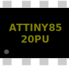

O ATtiny85 é um pequeno microcontrolador AVR de 8 bits. Possui 8 KB de memória de programa Flash, 512 bytes de SRAM e 512 bytes de EEPROM.



## Nome dos Pinos

| Pino | Nome | Funções           | Canal Analógico |
| ---- | ---- | ----------------- | --------------- |
| 1    | PB5  | Reset             | 0               |
| 2    | PB3  |                   | 3               |
| 3    | PB4  |                   | 2               |
| 4    | GND  | Terra             |                 |
| 5    | PB0  | SPI:MOSI, I2C:SDA |                 |
| 6    | PB1  | SPI:MISO          |                 |
| 7    | PB2  | SPI:SCK, I2C:SCL  | 1               |
| 8    | VCC  | Tensão positiva   |                 |

## Atributos

| Nome      | Descrição                                                                        | Valor padrão |
| --------- | -------------------------------------------------------------------------------- | ------------ |
| env       | Arduino core a ser usado: "attiny" ou "ATTinyCore"                               | "attiny"     |
| frequency | Frequência de clock do MCU, em hertz. Valores comuns: "1m", "8m", "16m", e "20m" | "8m"         |

## Código e bibliotecas

O Arduino core fornece as funções integradas, como `pinMode()` e `digitalRead()`, bem como um conjunto de bibliotecas padrão do Arduino, como Servo, Wire e SPI.

Ao compilar seu código para o ATtiny85, você pode escolher entre dois cores diferentes:

- [attiny](https://github.com/damellis/attiny) - Um core mínimo que fornece a maioria das funções padrão do Arduino. Este é o padrão.
- [ATTinyCore](https://github.com/SpenceKonde/ATTinyCore) - Core avançado que inclui as bibliotecas Wire, SPI, Servo e Serial. Saiba mais na [Documentação](https://github.com/SpenceKonde/ATTinyCore/blob/master/avr/extras/ATtiny_x5.md) do ATTinyCore.

Nota: O ATTinyCore é uma nova opção e não foi amplamente testado.

Para selecionar um core, defina o atributo "env" na parte `wokwi-attiny85`, por exemplo:

```json
  "parts": [
    {
      "type": "wokwi-attiny85",
      "id": "tiny",
      "attrs": {
        "env": "ATTinyCore"
      }
      …
    },
    …
  ]
```

### Depuração com TinyDebug

Você pode usar a [biblioteca TinyDebug](https://github.com/wokwi/TinyDebug) para imprimir mensagens de depuração do seu código. Essas mensagens aparecem no Monitor Serial do Wokwi. Para usar a biblioteca, inclua "TinyDebug.h" em seu projeto e crie um arquivo [libraries.txt](../guides/libraries) com o texto "TinyDebug" nele.

Chame `Debug.begin()` e, em seguida, imprima suas mensagens de depuração usando `Debug.println()`:

```cpp
#include <TinyDebug.h>

void setup() {
  Debug.begin();
  Debug.println(F("Olá, TinyDebug!"));
}

void loop() {
  /* Espalhe um pouco de código mágico aqui */
}
```

Da mesma forma, você pode usar o objeto `Debug` para ler a entrada do monitor serial do Simulador:

```cpp
if (Debug.read() == 'c') {
  // Faça algo, por exemplo alternar um LED
}
```

Para obter mais informações sobre os métodos disponíveis, verifique a [documentação da classe Stream](https://www.arduino.cc/reference/pt/language/functions/communication/stream/).

A interface `Debug` consome cerca de 30 bytes de SRAM e 150 bytes de memória Flash, dependendo de quais métodos você usa em seu código. Isso às vezes pode ser um problema, já que o ATtiny85 tem apenas 512 bytes de SRAM.

É por isso que o TinyDebug também fornece uma interface de registro leve e alternativa que não usa SRAM. Ele fornece duas funções, `tdPrint()` e `tdPrintln()`. A desvantagem é que você só pode imprimir strings no estilo C (`char*`):

```cpp
#include <TinyDebug.h>

void setup() {
  tdPrintln(F("Eu não uso SRAM!"));
}

void loop() {
  /* ... */
}
```

A biblioteca TinyDebug funciona fora da caixa no Wokwi, sem nenhuma alteração em seu diagrama. Usa uma
interface de depuração interna que faz parte do mecanismo de simulação Wokwi e não usa nenhum pino do MCU.

Você pode executar com segurança o código que usa o TinyDebug em um chip ATtiny85 físico. O chip físico não
tem a interface de depuração, então você obviamente não verá as mensagens de depuração, mas além disso,
não deve interferir no seu código.

Para um exemplo completo de código, confira o [projeto de demonstração do TinyDebug no Wokwi](https://wokwi.com/projects/300650387867697672).

### Saída Serial

O ATtiny85 não tem um periférico UART dedicado, mas ainda é possível obter saída serial usando a biblioteca Software Serial.
Para obter mais informações e código de demonstração, consulte o [Guia do Monitor Serial](../guides/serial-monitor#attiny85--softwareserial)

### I2C

Para comunicação I2C, use a biblioteca [TinyWireM](https://github.com/adafruit/TinyWireM).

## Recursos do simulador

O ATtiny85 é simulado usando a [Biblioteca AVR8js](https://github.com/wokwi/avr8js). A tabela abaixo resume o status dos recursos:

| Periférico           | Status | Notas                                                |
| -------------------- | ------ | ---------------------------------------------------- |
| Processador          | ✔️     |                                                      |
| GPIO                 | ✔️     | 6 pinos GPIO (PB0...PB6), Suporte para INT0/PCINT    |
| USI                  | 🟡     | Só funciona no modo I2C                              |
| Timer0               | ✔️     | Suporte PWM para PB0/PB1                             |
| Timer1               | ❌     |                                                      |
| Watchdog Timer       | ✔️     |                                                      |
| EEPROM               | ✔️     |                                                      |
| ADC                  | ✔️     | Usado por analogRead()                               |
| Comparador Analógico | ❌     |                                                      |
| Depuração GDB        | ✔️     | Consulte o [Guia do Depurador GDB](../gdb-debugging) |

Legenda:
✔️ Simulado
🟡 Suporte parcial
❌ Não implementado

Se você precisar de algum dos recursos ausentes, [abra uma solicitação de recurso no repositório AVR8js](https://github.com/wokwi/avr8js/issues/new)
ou [entre em contato no Discord](https://wokwi.com/discord).

## Exemplos no simulador

- [ATtiny85 Blink](https://wokwi.com/projects/283019827166052872)
- [ATtiny85 Simon Game](https://wokwi.com/projects/285525640477671948)
- [ATtiny85 FastLED Matrix](https://wokwi.com/projects/283910810787381773)
- [ATtiny85 Charlieplexing](https://wokwi.com/projects/283912288194265608)
- [ATtiny85 SSD1306 + DHT](https://wokwi.com/projects/292900020514980360)
