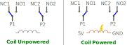

Relé de duas chaves de duas posições (DPDT)

<wokwi-ks2e-m-dc5 />

## Nome dos Pinos

| Nome  | Descrição                                                             |
| ----- | --------------------------------------------------------------------- |
| COIL1 | Primeiro terminal da bobina                                           |
| COIL2 | Segundo terminal da bobina                                            |
| P1    | Primeiro pólo                                                         |
| NC1   | Normalmente fechado - conectado a P1 quando a bobina não é alimentada |
| NO1   | Normalmente aberto - conectado a P1 quando alimentado pela bobina     |
| P2    | Segundo pólo                                                          |
| NC2   | Normalmente fechado - conectado a P2 quando a bobina não é alimentada |
| NO2   | Normalmente aberto - conectado a P2 quando alimentado por bobina      |

## Operação

O relé é um interruptor eletrônico com dois estados: bobina sem alimentação e bobina com alimentação. Por padrão, a bobina não é alimentada. Você pode alimentar a bobina aplicando tensão entre os pinos COIL1 e COIL2.

Quando a bobina está desenergizada, P1 é conectado a NC1 e P2 é conectado a NC2 (NC significa normalmente fechado/conectado).

Quando a bobina é alimentada, P1 é conectado a NO1 e P2 é conectado a NO2 (NC significa normalmente aberto/desconectado).

O diagrama a seguir resume os estados do relé:

## Exemplos no simulador

- [Um Relé controlando dois LEDs](https://wokwi.com/projects/322846360729551444)
- [Flip-flop com Relé](https://wokwi.com/projects/322802227591774802) - Elemento de memória de bit único usando três relés
