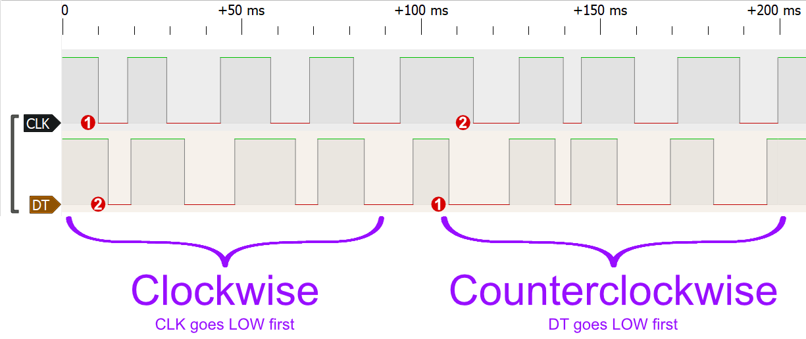
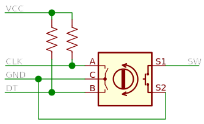

Módulo Encoder Rotativo KY-040 com 20 pulsos por revolução.

<wokwi-ky-040 />

## Nome dos Pinos

| Nome | Descrição                                                                         |
| ---- | --------------------------------------------------------------------------------- |
| CLK  | Pino A do encoder rotativo (Pulso de clock)                                       |
| DT   | Pino B do encoder rotativo (Pulso de direção)                                     |
| SW   | Pino do botão de pressão. Normalmente aberto, em curto com GND quando pressionado |
| VCC  | Alimentação positiva                                                              |
| GND  | Terra                                                                             |

## Operação

O encoder rotativo oferece duas formas de interação:

- **Rotação** - Você pode girar o botão clicando nas setas.
  A seta superior gira um passo no sentido horário, e a seta
  inferior gira um passo no sentido anti-horário. Girando o botão
  irá produzir sinais digitais nos pinos DT e CLK, como
  explicado abaixo.
- **Botão** - Clique no botão para pressionar o botão.
  Enquanto pressionado, o botão conecta o pino SW ao pino GND.

Cada vez que o usuário gira o botão, ele produz um sinal BAIXO
nos pinos DT e CLK:

- Girar no sentido horário faz com que o pino CLK gere um sinal baixo primeiro e,
  em seguida, o pino DT vai para o nível baixo também.
- Girar no sentido anti-horário faz com que o pino DT gere um sinal baixo primeiro e
  então o pino CLK vai para nível baixo.

Ambos os pinos voltarão para o nível alto em alguns milissegundos. O diagrama
a seguir ilustra isso:



Você pode fazer experimentos com os tempos dos pinos DT/CLK conectando-os ao
[Analisador Lógico Wokwi](wokwi-logic-analyzer). Confira o [Guia do Analisador Lógico](../guides/logic-analyzer)
para aprender como usar.

### Esquemas

O módulo KY-040 inclui dois resistores internos de pull-up que
colocam os pinos CLK e DT em VCC. A simulação sempre coloca esses
pinos em nível alto, mesmo se você deixou o pino VCC flutuando.



## Usando o Encoder Rotativo no Arduino

### Lendo a rotação

Você pode ler a rotação verificando o status do pino CLK. Sempre que estiver BAIXO, leia o
valor do pino DT para determinar a direção: HIGH significa rotação no sentido horário, LOW significa
rotação anti-horária. Exemplo de código:

```cpp
#define ENCODER_CLK 2
#define ENCODER_DT  3

void setup() {
  Serial.begin(115200);
  pinMode(ENCODER_CLK, INPUT);
  pinMode(ENCODER_DT, INPUT);
}

int lastClk = HIGH;

void loop() {
  int newClk = digitalRead(ENCODER_CLK);
  if (newClk != lastClk) {
    // Houve uma mudança no pino CLK
    lastClk = newClk;
    int dtValue = digitalRead(ENCODER_DT);
    if (newClk == LOW && dtValue == HIGH) {
      Serial.println("Girando no sentido horário ⏩");
    }
    if (newClk == LOW && dtValue == LOW) {
      Serial.println("Girando no sentido anti-horário ⏪");
    }
  }
}
```

Você também pode [executar este exemplo no Wokwi](https://wokwi.com/projects/304184298969236032).

Nota: seu código precisará ler o estado dos pinos com frequência para detectar as rotações corretamente.
Se a sua rotina em `loop()` demorar muito tempo para ler o encoder (por exemplo: com o uso da função `delay()` em seu código), recomendamos usar [attachInterrupt()](https://www.arduino.cc/reference/pt/language/functions/external-interrupts/attachinterrupt/) para receber as alterações no pino CLK. Supondo que CLK esteja conectado ao pino 2 e DT ao pino 3 (como antes):

```cpp
#define ENCODER_CLK 2
#define ENCODER_DT  3

void setup() {
  pinMode(ENCODER_CLK, INPUT);
  pinMode(ENCODER_DT, INPUT);
  attachInterrupt(digitalPinToInterrupt(ENCODER_CLK), readEncoder, FALLING);
}

void readEncoder() {
  int dtValue = digitalRead(ENCODER_DT);
  if (dtValue == HIGH) {
    Serial.println("Girando no sentido horário ⏩");
  }
  if (dtValue == LOW) {
    Serial.println("Girando no sentido anti-horário ⏪");
  }
}

void loop() {
  // Faça o que for preciso
}
```

### Usando o botão

Para ler o estado do botão do encoder, conecte-o a qualquer pino IO do Arduino e inicialize o pino como `INPUT_PULLUP`. Em seguida, leia o estado do botão usando `digitalRead()`.
A leitura será BAIXA enquanto o botão for pressionado.

O exemplo de código a seguir acenderá o LED integrado do Arduino (13) enquanto o botão estiver pressionado.
Ele assume que você conectou o SW ao pino 4 do Arduino.
Você também precisa conectar o pino GND a um dos pinos GND do Arduino.

```cpp
#define ENCODER_BTN 4

void setup() {
  pinMode(ENCODER_BTN, INPUT_PULLUP);
  pinMode(LED_BUILTIN, OUTPUT);
}

void loop() {
  if (digitalRead(ENCODER_BTN) == LOW) {
    digitalWrite(LED_BUILTIN, HIGH);
  } else {
    digitalWrite(LED_BUILTIN, LOW);
  }
}
```

## Controle pelo teclado

Para controlar o encoder com o teclado, clique nele primeiro, e em seguida, use as seguintes teclas:

| Tecla            | Função                                  |
| ---------------- | --------------------------------------- |
| Direita / Cima   | Gira um passo no sentido horário\*      |
| Esquerda / Baixo | Gira um passo no sentido anti-horário\* |
| Barra de espaço  | Pressiona o botão do encoder            |

\* Mantenha as teclas pressionadas para girar continuamente o encoder,
   gerando uma série de pulsos nos pinos CLK/DT.

## Exemplos no simulador

- [Exemplo de uso básico](https://wokwi.com/projects/304184298969236032)
- [Contador do encoder rotativo](https://wokwi.com/projects/304184909747978816)
