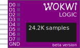

Analisador lógico digital de 8 canais

## Nome dos Pinos

Os pinos D0 a D7 são conectados aos canais de entrada do analisador lógico. Há também um pino GND, que deve ser conectado ao aterramento digital.

## Atributos

| Nome       | Descrição                                   | Valor padrão  |
| ---------- | ------------------------------------------- | ------------- |
| bufferSize | Número máximo de amostras para coletar      | "1000000"     |
| filename   | Nome do arquivo de gravação, sem a extensão | "wokwi-logic" |

### Buffer de Amostras

O analisador lógico usa um buffer para armazenar os dados dos pinos gravados. Cada mudança de nível de pino (por exemplo, baixo para alto) ocupa um slot no buffer. O simulador aloca
a memória para o buffer com antecedência, para garantir uma simulação rápida.

Você pode escolher o tamanho do buffer configurando o atributo `bufferSize`. Cada slot no buffer usa 9 bytes de RAM. Sendo assim, o tamanho do buffer padrão de 1 milhão
de amostras usará cerca de 9 MB de RAM. Alocar um buffer grande pode sobrecarregar seu navegador.

O analisador lógico exibe o número de amostras capturadas durante a execução da simulação. Você pode usar esse número para estimar o tamanho do buffer necessário.

## Visualizando os Dados

Quando a simulação é interrompida, o analisador lógico baixa um arquivo com as amostras registradas para o seu computador. O arquivo de gravação usa o formato padrão [Value Change Dump (VCD)](https://en.wikipedia.org/wiki/Value_change_dump). O arquivo é denominado "wokwi-logic.vcd" por padrão, mas você pode configurar o nome usando o atributo `filename`.

Para saber como visualizar os dados, visite o nosso [Guia do Analisador Lógico](../guides/logic-analyzer#usando-o-analisador-lógico).
