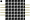

import DotMatrix from './wokwi-max7219-matrix.svg';
import DotMatrixChain4 from './wokwi-max7219-matrix-chain-4.svg';

Módulo Matriz de LED 8x8 com MAX7219

## Nome dos Pinos

| Nome | Descrição                |
| ---- | ------------------------ |
| VCC  | Tensão de alimentação    |
| GND  | Terra                    |
| DIN  | Entrada de dados         |
| CS   | Seletor de transferência |
| CLK  | Entrada de clock         |
| DOUT | Saída de dados           |

## Atributos

| Nome   | Descrição                                       | Valor padrão |
| ------ | ----------------------------------------------- | ------------ |
| chain  | Quantas unidades devem ser encadeadas           | "1"          |
| color  | Cor do LED (quando aceso)                       | "red"        |
| layout | Layout de conexão da matriz: "parola" ou "fc16" | "parola"     |

### Encadeamento

Cada unidade matricial é uma matriz de LEDs 8x8. Todos os LEDs da matriz têm a mesma cor. Você pode tornar a exibição mais ampla definindo o atributo "chain". Por exemplo, definir "chain" como 4 encadeará quatro unidades de matriz de pontos horizontalmente, resultando em uma matriz de 32x8 (quatro vezes a matriz de 8x8).

Se você deseja encadear unidades de uma forma personalizada (por exemplo, selecionar uma cor de pixel diferente para cada unidade, encadear-los verticalmente, etc), conecte o pino DOUT de uma unidade ao pino DIN da próxima unidade. Você também precisa conectar os pinos CLK / CS das unidades.

Veja o [Túnel de matriz de LEDs 32x32](https://wokwi.com/projects/318864638990090834) para obter um exemplo.

### Layout da matriz

Existem vários tipos de layout da matriz, com base nos módulos comumente disponíveis. Você pode definir a propriedade "layout" para escolher o layout do pixel desejado:

"parola" - Consulte a [documentação do Parola](https://majicdesigns.github.io/MD_MAX72XX/page_parola.html) para obter informações sobre o layout desses módulos
"fc16" - Os módulos FC-16 estão disponíveis no EBay e no AliExpress. Eles geralmente vêm em uma cadeia de quatro matrizes 8x8, portanto, têm no total 32x8 pixels.

A escolha do layout incorreto fará com que seu texto / desenho seja girado e / ou espelhado.

### Exemplos

| Resultado                                        | Attrs                  |
| ------------------------------------------------ | ---------------------- |
| <DotMatrix style={{'--pixel-color': 'green'}} /> | `{ "color": "green" }` |
| <DotMatrixChain4/>                               | `{ "chain": "4" }`     |

## Exemplos no simulador

- [Relogio Matrix de LED](https://wokwi.com/projects/289186888566178317)
- [Esboço de um jogo Etch](https://wokwi.com/projects/296234816685212169)
- [Dados Eletrônicos (no ATtiny85)](https://wokwi.com/projects/291779699024069128)
- [Gerador de código QR no Arduino](https://wokwi.com/projects/318641692720759379)
- [Túnel de matriz de LEDs 32x32](https://wokwi.com/projects/318864638990090834)
- [Exemplos da biblioteca MD_Parola](https://wokwi.com/arduino/libraries/MD_Parola)
