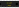

Driver de LED tricolor serial (SPI)

Use o registrador de deslocamento NLSF595 para conectar LEDs RGB que consomem muita energia ao seu microcontrolador. Uma única unidade pode controlar dois LEDs RGB e uma cadeia de duas unidades pode controlar até cinco LEDs RGB.

## Nome dos Pinos

| Pino   | Descrição                                                         |
| ----- | ------------------------------------------------------------------ |
| SI    | Entrada serial                                                     |
| SCK   | Clock serial                                                       |
| RCK   | Pino de armazenamento (latch)                                      |
| OE    | Saída habilitada, ativo em baixo. Conecte ao GND se não for usado. |
| QA…QH | Saída paralela                                                     |
| SQH   | Saída serial\*                                                     |
| SCLR  | Reset (limpa), ativo em baixo. Conecte ao VCC se não for usado     |
| GND   | Terra                                                              |
| VCC   | Tensão de alimentação                                              |

\* Use o Q7S para encadear várias unidades NLSF595 juntas. Conecte o SQH ao pino SI do próximo chip NLSF595 na cadeia.

## Usando o NLSF595

Você precisará conectar pelo menos 3 pinos ao seu microcontrolador: SI, SCK e RCK.

O pino OE pode ser usado para desabilitar a saída do registrador de deslocamento. Se você precisar dessa funcionalidade,
conecte-o ao seu microcontrolador. Caso contrário, conecte-o ao terra para habilitar permanentemente a saída.

Os pinos de saída do registrador de deslocamento, QA a QH, são conectados geralmente aos pinos de entrada do ânodo comum dos [LEDs RGB](wokwi-rgb-led).

## Exemplos no simulador

- [Driver NLSF595 com 2 LEDs RGB](https://wokwi.com/projects/315085666329297472)
