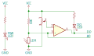

Módulo sensor fotoresistor (LDR)

<wokwi-photoresistor-sensor />

## Nome dos Pinos

| Nome | Descrição                     |
| ---- | ----------------------------- |
| VCC  | Fonte de alimentação positiva |
| GND  | Terra                         |
| DO   | Saída digital                 |
| AO   | Saída analógica               |

## Atributos

| Nome      | Descrição                               | Valor padrão |
| --------- | --------------------------------------- | -------------|
| lux       | Valor do nível de iluminância (lx)      | "500"        |
| threshold | Tensão de limiar da saída digital (Vth) | "2.5"        |
| rl10      | Resistência LDR @ 10lx (em kilo-ohms)   | "50"         |
| gamma     | Inclinação do gráfico log(R) / log(lx)  | "0.7"        |

## Operação

O módulo do sensor fotoresistor inclui um LDR (resistor dependente de luz) em série com um resistor de 10K. O pino AO é conectado entre o LDR e o resistor de 10K.

A tensão no pino AO depende do nível de iluminância - ou seja, a quantidade de luz que incide sobre o sensor. Você pode ler essa tensão conectando o pino AO do sensor fotorresistor a um pino de entrada analógica e, em seguida, usando a função `analogRead()`.

Existem dois parâmetros que controlam a sensibilidade do LDR: rl10 e gama. rl10 é a resistência do LDR com nível de iluminância de 10lx. O valor gama determina a inclinação do gráfico log(R) / log(lx). Normalmente, você pode encontrar esses dois valores na folha de dados do LDR.

A tabela a seguir mostra a relação entre o nível de iluminância (lux), resistência (R) e o nível de tensão
no pino AO quando gama = 0,7 e rl10 = 50 (os valores padrão):

| Condição                  | Nível de iluminância (lux) | Resistência LDR | Tensão\* | valor analogRead() |
| ------------------------- | -------------------------- | --------------- | -------- | ------------------ |
| Lua cheia                 | 0.1                        | 1.25MΩ          | 4.96     | 1016               |
| Crepúsculo profundo       | 1                          | 250kΩ           | 4.81     | 985                |
| Crepúsculo                | 10                         | 50kΩ            | 4.17     | 853                |
| Monitor do computador\*\* | 50                         | 16.2kΩ          | 3.09     | 633                |
| Iluminação da escada      | 100                        | 9.98kΩ          | 2.50     | 511                |
| Iluminação do escritório  | 400                        | 3.78kΩ          | 1.37     | 281                |
| Dia nublado               | 1,000                      | 1.99kΩ          | 0.83     | 170                |
| Luz do dia                | 10,000                     | 397Ω            | 0.19     | 39                 |
| Luz direta do sol         | 100,000                    | 79Ω             | 0.04     | 8                  |

\* Quando VCC = 5V  
\*\* Medido a um metro de distância do monitor

O código a seguir para converter o valor de retorno de `analogRead()` em um valor de nível de iluminância (em lux):

```cpp
// Essas constantes devem corresponder aos atributos "gama" e "rl10" do fotoresistor
const float GAMMA = 0.7;
const float RL10 = 50;

// Converte o valor analógico em valor lux:
int analogValue = analogRead(A0);
float voltage = analogValue / 1024. * 5;
float resistance = 2000 * voltage / (1 - voltage / 5);
float lux = pow(RL10 * 1e3 * pow(10, GAMMA) / resistance, (1 / GAMMA));
```

### Saída digital

O pino de saída digital ("DO") fica em nível alto quando está escuro e baixo quando há luz. No sensor físico, você ajusta o pequeno potenciômetro integrado para definir o limite. No simulador, use o atributo "limite" para definir a tensão limite. O limite padrão é 2,5 volts ou cerca de 100 lux.

O LED inferior ("LED DO") está conectado à saída digital e acende sempre que o pino DO fica baixo. Em outras palavras, ele acende quando o sensor é iluminado.

### Esquemático



## Exemplos no simulador

- [Exemplo de fotoresistor digital](https://wokwi.com/projects/305193592908939842)
- [Exemplo de fotoresistor analógico](https://wokwi.com/projects/305193627138654786)
