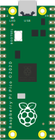

Raspberry Pi Pico, uma placa microcontrolada RP2040 com processador ARM Cortex-M0+dual-core, 264k de RAM interna e flexível
Recurso de I/O programável (PIO).



## Nome dos Pinos

Os pinos GP0 a GP22 são pinos GPIO digitais. Os pinos GP26, GP27 e GP28 são pinos GPIO digitais com função de entrada analógica.

| Nome            | Descrição                     | Canal de entrada analógica |
| --------------- | ----------------------------- | -------------------------- |
| GP0 … GP22      | Pinos digitais GPIO (0 a 22)  |                            |
| GP26            | Pino digital GPIO 26          | 0                          |
| GP27            | Pino digital GPIO 27          | 1                          |
| GP28            | Pino digital GPIO 28          | 2                          |
| GND.1 … GND.8   | Pinos de aterramento \*       |                            |
| VSYS, VBUS, 3V3 | Fonte de alimentação positiva |                            |
| TP4 †           | Pino digital GPIO 23          |                            |
| TP5 †           | Pino digital GPIO 25 + LED    |                            |

\* Os números dos pinos físicos dos pinos de aterramento são 3, 8, 13, 18, 23, 28, 33 e 38.
† Esses pinos não aparecem no editor de diagrama visual, mas você pode usá-los em seu arquivo [diagram.json](../diagram-format).

Os pinos 3V3_EN / RUN / ADC_VREF não estão disponíveis na simulação e, portanto, são omitidos na tabela.

### LED integrado

O Rasberry Pi Pico tem um LED integrado, conectado ao pino GPIO 25. O LED acende quando o pino é elevado.

Você também pode usar a constante `LED_BUILTIN` para fazer referência ao LED em seu código Arduino:

```cpp
pinMode(LED_BUILTIN, OUTPUT);
digitalWrite(LED_BUILTIN, HIGH);
```

Veja o [Blink](https://wokwi.com/projects/297755575592157709) para um exemplo de código completo.

## Recursos do simulador

O Raspberry Pi Pico é simulado usando a [Biblioteca RP2040js](https://github.com/wokwi/rp2040js).
Esta tabela resume o status dos recursos da simulação:

| Periférico               | Status | Notas                                                |
| ------------------------ | ------ | ---------------------------------------------------- |
| Núcleo do processador    | ✔️     | Apenas um único núcleo é simulado                    |
| GPIO                     | ✔️     |                                                      |
| PIO                      | ✔️     | Não amplamente testado; PIO Debugger disponível      |
| USB                      | ❌     |                                                      |
| UART                     | ✔️     |                                                      |
| I2C                      | ✔️     | Modo mestre apenas                                   |
| SPI                      | ✔️     | Master mode only                                     |
| PWM                      | ✔️     |                                                      |
| DMA                      | ✔️     |                                                      |
| Timer                    | ✔️     | A pausa do cronômetro ainda não foi implementada     |
| ARM SysTick Timer        | 🟡     | Implementação parcial                                |
| Watchdog                 | ❌     |                                                      |
| RTC                      | ❌     |                                                      |
| ADC + Sensor Temperatura | ✔️     | O sensor de temperatura sempre lê o valor 0          |
| SSI                      | 🟡     | Apenas o mínimo para deixar o bootloader feliz       |
| GDB Debugging            | ✔️     | Consulte o [Guia de depuração GDB](../gdb-debugging) |

Legenda:
✔️ Simulado
🟡 Implementação parcial/trabalho em andamento
❌ Não implementado

### Arduino core

O núcleo do Arduino fornece as funções integradas do Arduino, como `pinMode()` e `digitalRead()`, bem como um conjunto de bibliotecas padrão do Arduino, como Servo, Wire e SPI.

Ao compilar seu código para o Raspberry Pi Pico, você pode escolher entre dois núcleos diferentes:

- O [núcleo oficial do Pi Pico](https://github.com/arduino/ArduinoCore-mbed), baseado no sistema operacional Mbed. Este é o padrão.
- [Mantido pela comunidade Pi Pico Arduino Core](https://github.com/earlephilhower/arduino-pico), construído sobre o [Pi Pico SDK](https://github.com/raspberrypi/pico-sdk).

Você pode aprender sobre as principais diferenças entre esses dois núcleos [neste comentário do GitHub](https://github.com/earlephilhower/arduino-pico/issues/117#issuecomment-830356795).

Para selecionar um núcleo, defina o atributo "env" da parte `wokwi-pi-pico`. Para o núcleo oficial do Arduino, use o valor "arduino-core". Para o núcleo mantido pela comunidade, defina "env" como "arduino-community". por exemplo.:

```json
  "parts": [
    {
      "type": "wokwi-pi-pico",
      "id": "pico",
      "attrs": {
        "env": "arduino-community"
      }
      …
    },
    …
  ]
```

### Monitor Serial

Você pode usar o Serial Monitor para receber informações do código em execução no Pi Pico, como impressões de depuração. Para configurar a conexão do monitor serial com o Raspberry Pi Pico, adicione as seguintes conexões ao seu arquivo [diagram.json](../diagram-format#onnections):

```json
  "connections": [
    [ "$serialMonitor:RX", "pico:GP0", "", [] ],
    [ "$serialMonitor:TX", "pico:GP1", "", [] ],
    …
  ]
```

O exemplo assume que o Pi Pico foi definido com um id de "pico", por ex.

```json
  "parts": [
    {
      "type": "wokwi-pi-pico",
      "id": "pico",
      …
    },
    …
  ]
```

Para inicializar o monitor Serial em seu código, use `Serial1.begin(115200)`, e então imprima as mensagens com `Serial1.println()`. Por exemplo:

```cpp
void setup() {
  Serial1.begin(115200);
  Serial1.println("Hello, world!");
}

void loop() { }
```

Observe o uso de `Serial1`. O `Serial` padrão no Arduino Core usa Serial over USB (CDC), que atualmente não é suportado na simulação. `Serial1`, em contraste, usa o hardware UART (conectado aos pinos GP0/GP1).

Para um exemplo completo, confira o [Exemplo de monitor serial Pi Pico](https://wokwi.com/projects/297755360074138125).

## Exportando binário UF2

Você pode carregar o programa do emulador diretamente em uma placa física Raspberry Pi Pico. As etapas são:

1. Pressione "F1" no editor de código Wokwi e selecione "Download UF2 Binary".
   O download deve começar em alguns segundos.
2. Inicie seu Pi Pico no modo bootloader. Você pode fazer isso pressionando o botão do carregador de boot enquanto estiver
   conectando o Pi Pico na porta USB do seu computador.
3. Você deve ver uma nova unidade aparecer em seu computador (chamada "RPI-RP2"). Copie o arquivo UF2 que você baixou para essa unidade.

## MicroPython Suporte

O Raspberry Pi Pico oferece suporte a MicroPython e você pode usá-lo para executar projetos MicroPython no Wokwi. Para obter mais informações, consulte o [Guia MicroPython](../guides/micropython).

## Exemplos no simulador

- [LCD1602 com Pi Pico](https://wokwi.com/projects/297323005822894602)
- [Semáforo com Pi Pico](https://wokwi.com/projects/297322571959894536)
- [Pi Pico C++ SDK Blink](https://wokwi.com/projects/298013072042230285)
- [Pi Pico C++ SDK 7-Segment Example](https://wokwi.com/projects/298014884249993738)
