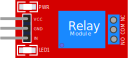

Interruptor eletromecânico

## Nome dos Pinos

| Nome | Descrição                                            |
| ---- | ---------------------------------------------------- |
| VCC  | Tensão de alimentação                                |
| GND  | Terra                                                |
| IN   | Sinal de controle (por exemplo, do microcontrolador) |
| NC   | Normalmente fechado                                  |
| COM  | Pino comum                                           |
| NO   | Normalmente aberto                                   |

## Operação

O relé é um interruptor eletrônico.

Quando o pino `IN` está baixo / desconectado, `COM` é conectado a `NC` (NC significa normalmente fechado).

Quando o pino `IN` é alto, `COM` é conectado a `NO` (NO significa normalmente aberto).

## Exemplos no simulador

- [Um módulo de relé controlando dois LEDs](https://wokwi.com/projects/347308007359513172)

