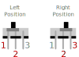

Interruptor deslizante padrão (SPDT) Single Pole Double Throw.

<wokwi-slide-switch />

## Nome dos Pinos

| Nome | Descrição         |
| ---- | ----------------- |
| 1    | Terminal esquerdo |
| 2    | Terminal comum    |
| 3    | Terminal direito  |

O interruptor deslizante tem três pinos. O pino 2 (no meio) é o pino comum. Dependendo da posição
da manopla da chave, ele é conectado ao pino 1 ou 3:

| Posição da chave | Descrição              |
| ---------------- | ---------------------- |
| Esquerda         | Conecta os pinos 1 e 2 |
| Direita          | Conecta os pinos 3 e 2 |

O diagrama a seguir ilustra as conexões dentro da chave deslizante. Você pode ver o contato cinza deslizado
que se move junto com a manopla da chave e cria uma conexão entre o pino 2 e o pino 1 ou 3:

## Atributos

| Nome   | Descrição                                                                             | Valor padrão |
| ------ | ------------------------------------------------------------------------------------- | ------------ |
| value  | Posição inicial do interruptor deslizante: "" para a esquerda, "1" para a direita | ""           |
| bounce | Defina como "0" para desativar o bouncing                                             | ""           |

### Bouncing

Quando você move uma chave deslizante física, o circuito abre e fecha dezenas ou centenas de vezes.
Este fenômeno é chamado de [Bouncing](wokwi-pushbutton#bouncing).

O Wokwi simula o bouncing do interruptor por padrão. Você pode desativar a simulação de bouncing para interruptores individuais, definindo o atributo "bounce" para "0":

`{ "bounce": "0" }`

## Exemplos no simulador

- [Slide Switch and LED](https://wokwi.com/projects/288276100805558797) - Usando um botão deslizante para alternar um LED
- [Slide Switch and 2 LEDs](https://wokwi.com/projects/288278249939665421) - Um interruptor deslizante que alterna entre 2 LEDs
- [Digital Pin Output Switching](https://wokwi.com/projects/292033853022798344) - Um interruptor deslizante que redireciona a saída de um pino digital para um dos dois LEDs
