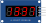

Módulo display de LED sete segmentos com interface TM1637 de 4 fios

## Nome dos Pinos

| Nome | Descrição                 |
| ---- | ------------------------- |
| CLK  | Segmento superior         |
| DIO  | Segmento superior direito |
| VCC  | Segmento inferior direito |
| GND  | Segmento inferior         |

## Atributos

| Nome  | Descrição                  | Valor padrão |
| ----- | -------------------------- | ------------ |
| color | A cor dos LEDs do segmento | "red"        |

## Usando o display de 7 segmentos

Esta variante do display de sete segmentos usa o chip TM1637. Você só precisará de 2 pinos do microcontrolador para se comunicar com ele.

O protocolo de comunicação TM1637 não é padrão. Assemelha-se ao protocolo I2C, mas é mais simples e incompatível com o I2C. Felizmente, você pode usar uma biblioteca e não se preocupar com a implementação do protocolo. Aqui estão algumas bibliotecas TM1637 que você pode usar no Arduino: [SevenSegmentTM1637@1.0.0](https://github.com/bremme/arduino-tm1637), Módulo Display 4 Digitos Grove.

## Exemplos no simulador

- [Contador com TM1637](https://wokwi.com/projects/339227323398095442)
- [Relógio com TM1637](https://wokwi.com/projects/339227567530705492)
- [Termômetro com TM1637 (MicroPython no Pi Pico)](https://wokwi.com/projects/339373435833549395)
