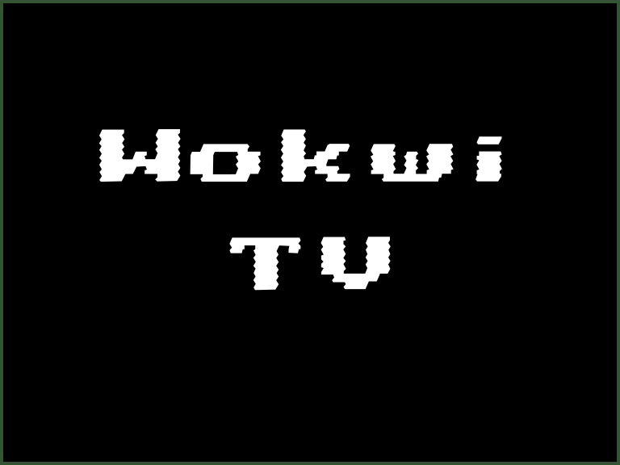

Tela de TV analógica (PAL) em preto e branco.



## Nome dos Pinos

| Nome | Descrição               |
| ---- | ----------------------- |
| IN   | Sinal de dados (imagem) |
| SYNC | Sinal de sincronização  |
| GND  | Terra                   |

## Operação

A resolução da simulação da TV no padrão PAL (Phase Alternating Line) é de 768x576 pixels e a proporção da imagem é 4:3.

O vídeo na codificação PAL usa sinal analógico. O sinal é transportado pelo ar ou por meio de um cabo. Um dos padrões de cabeamento comum é o vídeo composto, que combina os dados de pixel junto com os sinais de sincronização e os dados de cor em um único fio.

A Wokwi TV não oferece suporte a informações de cores e separa os dados de pixel dos sinais de sincronização. A separação dos sinais facilita a geração da imagem por meio de um microcontrolador digital.

Use o pino _IN_ para os dados de pixel e o pino _SYNC_ para os pulsos de sincronização. A biblioteca Arduino [TVout](https://github.com/pkendall64/arduino-tvout) pode controlar esses sinais para você.

### Sincronização do sinal

O simulador imita as temporizações no padrão PAL para os sinais a 25 quadros por segundo. Os quadros são entrelaçados: cada quadro é dividido em duas partes, chamadas "campos". O primeiro campo contém as linhas ímpares e o segundo campo contém as linhas pares. Cada quadro leva 40ms e cada campo leva 20ms (metade da duração de um quadro).

Cada quadro é dividido em 625 slots de tempo de 64µS. Cada intervalo de tempo contém os dados de pixel para uma única linha, mas algumas dessas linhas estão vazias - seu único uso é para sincronização.

O simulador espera que cada campo (meio quadro) comece com pelo menos um pulso de sincronização de ~z30uS. Isso significa que você deve manter a linha SYNC baixa por cerca de 30 µS. O padrão PAL dita uma série específica de pulsos de sincronização,
mas o simulador é bastante flexível: funciona bem mesmo com um único pulso de ~30uS.

Cada linha também deve começar com um pulso de sincronização curto de 4uS. Mantenha o sinal de DADOS baixo durante esses pulsos de sincronização.

O [Analisador Lógico](../guides/logic-analyzer) é muito útil para depurar os sinais de TV na codificação PAL.

## Conexão física da TV

O padrão PAL usa um sinal analógico. Ao executar no simulador, você não precisa se preocupar com isso, mas se quiser executar o jogo em uma TV física, será necessário gerar os seguintes níveis de voltagem:

- 0V para sinais de sincronização (HSYNC/VSYNC)
- 0,3V para pixels pretos
- 1V para pixels brancos

A boa notícia é que você só precisa de alguns resistores para converter o sinal digital (que funciona no simulador) em analógico.

O vídeo composto geralmente usa conectores RCA. Você precisaria fazer as seguintes conexões ao pino central do conector RCA:

1. Pino SYNC através de um resistor de 1KΩ\*
2. Pino DATA através de um resistor 470Ω\*
3. Opcionalmente, outro resistor de 75Ω que vai para o terra (o resistor geralmente já está embutido no circuito do receptor de TV).

\* se você usar uma placa de 3,3V (como o [Raspberry Pi Pico](wokwi-pi-pico)), use um resistor de 470Ω para SYNC e outro de 270Ω para DATA.

Certifique-se também de conectar o aterramento ao anel do conector RCA.

Como é que isso funciona? Implementamos um divisor de tensão simples para gerar as tensões necessárias, com base nos dois níveis de pinos digitais:

| SYNC       | DATA      | Voltagem de saída | Cálculo                                       |
| ---------- | --------- | ----------------- | --------------------------------------------- |
| Alto (5V)  | Alto (5V) | 0,95              | (5\*75)/((1/(1/1000+1/470))+75)               |
| Baixo (5V) | Baixo     | 0,304             | (5\*(1/(1/75+1/470)))/(1000+(1/(1/75+1/470))) |
| Alto       | Baixo     | 0                 | 0                                             |

Como você pode ver, manter tanto SYNC/DATA em sinal alto resulta em cerca de 1V, o nível de pixel branco, mantendo SYNC alto e DATA baixo resulta em cerca de 0,3 V, o nível de pixel preto, e direcionando ambos os pinos baixos resulta em 0 volts, que é o nível de sincronização.

Em teoria, usando esta configuração e direcionando DATA em alto enquanto o SYNC está baixo, você também pode gerar um nível de pixel cinza (~ 0,65V), mas isso não é atualmente suportado pelo simulador.

## Exemplo de código Arduino

Um exemplo simples que desenha um círculo usando a biblioteca TVout:

```cpp
// Conecte SYNC ao pino 9 e IN ao pino 7 do Arduino

#include <TVout.h>

TVout TV;

void setup() {
  TV.begin(PAL, 120, 96);
  TV.clear_screen();
  TV.draw_circle(60, 48, 32, WHITE);
}

void loop() {
}
```

## Exemplos no simulador

- [TVout demo reel](https://wokwi.com/projects/301776607665717769)
- [Jogo Flappy Cat](https://wokwi.com/projects/286182458416693768) - Use o botão azul para pular
- [Arduino Pong para Wokwi TV](https://wokwi.com/projects/290059909639176713)
- [Conway's Game of Life](https://wokwi.com/projects/299605461742649864)
