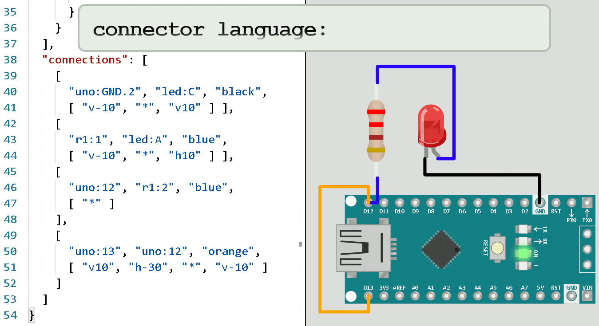

Each simulation project contains a diagram.json file. This files defines the components
that will be used for the simulation, their properties, and the connections between the
components.

## File structure

The diagram file is a JSON file with several sections. The basic file structure is as
follows:

```json
{
  "version": 1,
  "author": "Uri Shaked",
  "editor": "wokwi",
  "parts": [],
  "connections": []
}
```

`"version"` is always 1, `"author"` is the name of the person who created the
file, and `"editor"` is the name of the application that was used to edit the
file ("wokwi").

In addition, you can add a `"serialMonitor"` section to [configure the Serial Monitor](guides/serial-monitor#configuring-the-serial-monitor).

## Parts

The `"parts"` section defines the list of components in the simulation.
It's an array of objects with the following properties:

| Name   | Type    | Description                                     |
| ------ | ------- | ----------------------------------------------- |
| id     | string  | the unique identifier of the part (e.g. "led1") |
| type   | string  | the type of the part (e.g. "wokwi-led")         |
| left   | number  | x screen coordinate (in pixels)                 |
| top    | number  | y screen coordinate (in pixels)                 |
| attrs  | object  | part attributes (e.g. "color" for wokwi-led)    |
| rotate | number  | rotation in degress (e.g. 90)                   |
| hide   | boolean | if true, the part won't be visible              |

`id` and `type` are required, the other fields are optional.

For example, here's how you define a red LED called `"led1"` at position (x=100, y=50):

```json
{
  "id": "led1",
  "type": "wokwi-led",
  "left": 100,
  "top": 50,
  "attrs": {
    "color": "red"
  }
}
```

:::warning
Each part must have a unique "id" property. If two parts have the same "id",
the simulation may not function correctly.
:::

A partial list of part types (e.g. [wokwi-led](parts/wokwi-led)) can be found under the "Diagram Reference" section of this guide. We're currently working to expand this list. Meanwhile, some of the parts are also documented at [Wokwi Elements](https://elements.wokwi.com).

Each diagram should include a microcontroller part. The following microcontrollers are currently supported:

- [`wokwi-attiny85`](parts/wokwi-attiny85) - ATtiny85
- [`wokwi-arduino-nano`](parts/wokwi-arduino-nano) - Arduino Nano
- [`wokwi-arduino-mega`](parts/wokwi-arduino-mega) - Arduino Mega 2560
- [`wokwi-arduino-uno`](parts/wokwi-arduino-uno) - Arduino Uno R3
- [`wokwi-pi-pico`](parts/wokwi-pi-pico) - Raspberry Pi Pico
- `wokwi-esp32-devkit-v1` - ESP32
- `board-esp32-s2-devkitm-1` - ESP32-S2
- [`board-franzininho-wifi`](parts/board-franzininho-wifi) - ESP32-S2
- `board-esp32-c3-devkitm-1` - ESP32-C3
- `board-esp32-c3-rust-1` - ESP32-C3

:::tip
Instead of manually specifying the left/top coordinates for each item, you
can drag them with the mouse to the desired position.
:::

## Connections

The `"connections"` section defines how the parts are connected. Each connection is an array with four
items:

- The source component id and pin name, separated by a colon. e.g. `partId:pinName`
- The target component id and pin name
- The color of the wire (or an empty string to hide the wire)
- A list of instructions how to place the wire, as an array of strings (optional)

For example, the following definition will connect the A (anode) pin of `led1`
to pin 13 of the `uno` part:

```json
  ["led1:A", "uno:13", "green", []],
```

You can find the name of a component pin by moving the mouse over it.

### Wire placement mini-language

Each item in the `"connections"` section can specify a list of instructions
how to draw the lines for the wire. Wires always go in straight lines, either
horizontally or vertically, and never diagonally.

There are three instructions:

- "v" followed by a number of pixels: move vertically (up/down)
- "h" followed by a number of pixels: move horizontally (left/right)
- "\*" can appear only once. All the instructions that appear before the "\*"
  apply to the source pin, and the instructions that appear after it apply
  to the target pins.

For example:

```json
["v10", "h5", "*", "v-15", "h10"]
```

The "v10" will move 10 pixels down from the source pin, then "h5" will move
five pixels the right.

The instructions that appear after the "\*" are applied in reverse order: "h10" will
move 10 pixels right of the target pin, then "v-15" will move 15 pixels up.

Finally, the simulator will connect the two ends of the wire with a combination
of horizontal and a vertical wire that cover the remaining distance, as necessary.

### Wire placement animation

If you are a visual learner, you may find the following GIF animation useful.
The animation was created by Steve Sigma.


