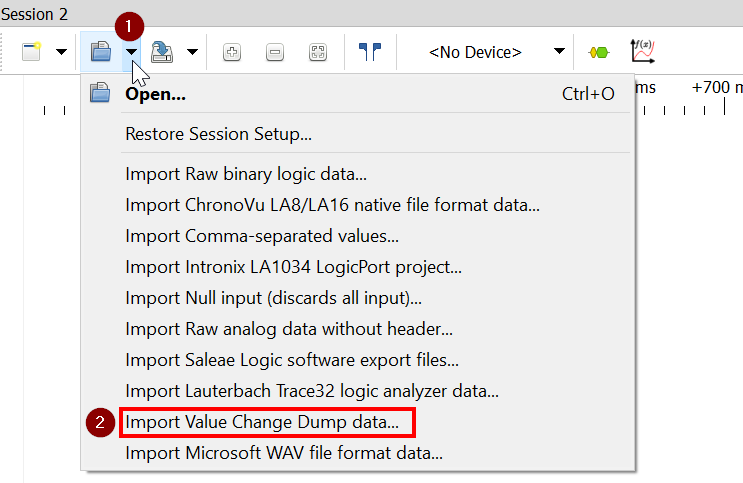

import LogicAnalyzerI2CImage from './logic-analyzer-i2c-decoder.png';

[逻辑分析仪](../parts/wokwi-logic-analyzer) 用于记录项目中数字信号的值。这是一个强大的调试工具，可以帮助你诊断电路和代码中的问题。它作为学习辅助工具也非常有用。

下面是一些使用案例:

- 观测 [analogWrite() 函数](https://www.arduino.cc/reference/en/language/functions/analog-io/analogwrite/) 生成的PWM信号
- 看 [舵机](../parts/wokwi-servo) 的控制信号
- 开发、调试 [Raspberry Pi Pico](../parts/wokwi-pi-pico) 的PIO状态机
- 查看SCL/SDA信号来学习I2C协议

<figure>
  
  <figcaption>Logic Analyzer: I2C protocol signals decoded in PulseView</figcaption>
</figure>


## 特点

Wokwi逻辑分析仪有8个数字通道，称为D0到D7。它的采样率为1GHz，这对大多数应用程序来说应该绰绰有余。

每个通道都有一个指示灯，每当通道上有活动时，LED就会变成绿色。指示灯提供了一种简单的方式来查看信号是否正确连接。

逻辑分析仪有一个小显示器。它显示了自仿真开始以来捕获的样本数量。

 [可配置触发器](#using-the-trigger) 允许你仅记录部分数据。例如，你可以在按下按钮时开始记录，或者仅在SPI通信处于活动状态时记录（使用SS引脚作为触发器）。

## 逻辑分析仪的使用

首先，将Logic Analyzer添加到你的项目中。可以点按紫色 Plus 按钮，然后选择“Logic Analyzer (8 个通道)”。

接下来，将要记录的信号连接到Logic Analyzer引脚。例如，如果你想记录Arduino Uno与某些外围设备（如 [DS1307 RTC](../parts/wokwi-ds1307) ），之间的I2C通信，你可以将引脚A4/A5（SDA/SCL信号）连接到Logic Analyzer的引脚D0/D1。

开始仿真。当信号传入时，你应该会看到绿色指示灯闪烁，并且显示的样本点数量会上升。

要查看捕获信号，请停止仿真。然后，将下载一个名为“wokwi-logic.vcd”的文件到你的计算机上。该文件是使用 [Value Change Dump](https://en.wikipedia.org/wiki/Value_change_dump) 格式记录的信号。

你可以使用PulseView或GTKWave等软件打开和查捕获信号文件。这些软件还包括强大的协议分析器，可以解码许多常见的协议，如UART、I2C、WS2812等。

### 触发器的使用

默认情况下，逻辑分析仪会记录整个仿真期间的数据。通过设置数字分析器输入引脚（默认为D7），你可以使用触发器控制数据的记录。

这里有一些一般情况的用例：

- [当按键按下时开始记录](https://wokwi.com/projects/313698551063380544)-将“触发模式”设置为“边缘”，并通过下拉电阻将触发引脚（D7）连接到地。将按钮的另一端连接到正电源（VCC/5V）。
- [当按键按下时开始记录](https://wokwi.com/projects/313706149095408193) - 与上面的设置相同，但`triggerMode`设置为“电平”（"level"）。
- [在1.5s之后开始记录](https://wokwi.com/projects/313706408220557888) - 将`triggerMode`设置为“边缘”（ "edge"），连接触发器引脚（D7），并在1.5秒后将引脚电平更改为高。

使用`triggerPin` 和 `triggerLevel` 属性，可配置触发引脚并设置触发电平（“高”或“低”）。有关更多信息，请查看[wokwi-logic-analyzer documentation](../parts/wokwi-logic-analyzer)。

### 在PulseView中观测数据

PulseView是一个开源逻辑分析仪 GUI。它在Linux、Windows、Mac OS X上都可以运行，甚至还有一个Android版本。你可以访问他们的[下载界面](https://sigrok.org/wiki/Downloads) 以获取最新版本。

通过单击“Open”按钮旁边的小箭头并选择：“Import Value Change Dump data...”来加载所采集信号（VCD）文件。



你将看到一个对话框，你可以在其中选择要导入的VCD文件。选择文件后，将出现另一个带有导入选项的对话框：


不幸的是，默认选项通常会导致PulseView消耗大量RAM并变得处理很慢。你可以通过设置**下采样因子**来减少内存使用量。**50**的值应该适用于大多数用例。下表列出了一些常见的值：

| Downsampling factor | Sample rate | 适用条件                                 |
| ------------------- | ----------- | ---------------------------------------- |
| 1000                | 1MHz        | 低频信号/长时间采集（10分钟以上）        |
| **50**              | **20MHz**   | 常见信号（UART、I2C、LED PWM、WS2812等） |
| 10                  | 100MHz      | 高速信号（10MHz+）                       |
| 1                   | 1GHz        | 超高速信号（50MHz+）                     |

确认导入选项后，你应该会在屏幕上看到导入的信号。信号名称将是“logic.D0”、“logic.D1”等。

要了解有关使用PulseView的更多信息，请参阅[PulseView user manual](https://sigrok.org/doc/pulseview/unstable/manual.html)。

#### 将Windows配置为在PulseView中打开VCD文件

你可以将Windows配置为在自动使用PulseView打开VCD文件。**以管理员**打开命令提示符（cmd）窗口，然后键入以下命令：

```
ftype vcdfile="%ProgramFiles%\sigrok\PulseView\pulseview.exe" "-I" "vcd:downsample=50" "%1"
assoc .vcd=vcdfile
```

请注意，这些命令在powershell中不起作用。仅在具有管理员权限的cmd下才可以。该命令将下采样因子设置为50，但你可以选择适合你需求的不同值（见上表）。

### 在GTKWave中查看数据

[GTKWave](http://gtkwave.sourceforge.net/) 是一个开源的跨平台波形查看器软件。GTKWave可以打开Wokwi Logic Analyzer生成的VCD文件。

[wokwi2gtkwave Python script](https://github.com/bvandepo/wokwi2gtkwave) 是一个用户贡献的自动化项目，用于将GTKWave与Wokwi一起使用：它可以监控你的下载目录，并使用GTKWave自动打开新文件。该脚本还将GTKWave配置为自动显示来自VCD文件的信号，并缩放它们以适合你的屏幕。
