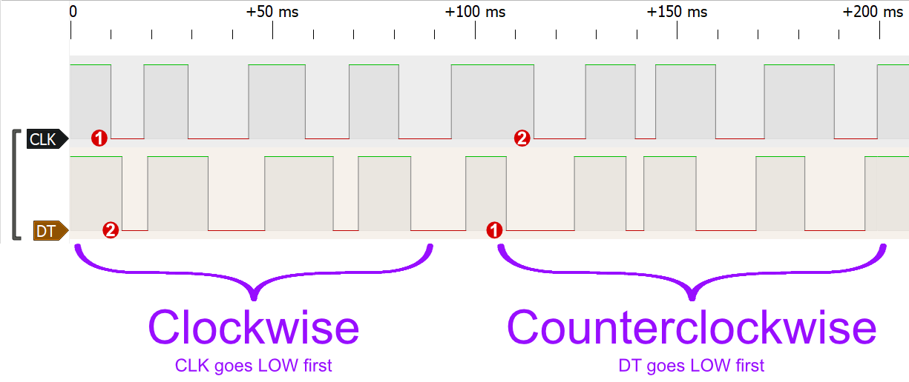
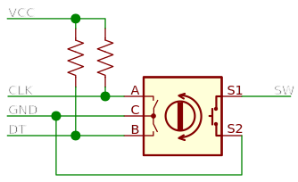

KY-040旋转编码器模块，每转20步。

<wokwi-ky-040 />

## 引脚名称

| Name | 描述                                          |
| ---- | --------------------------------------------- |
| CLK  | 旋转编码器引脚A                               |
| DT   | 旋转编码器引脚B                               |
| SW   | 按钮按下引脚。正常情况下为断开，在按下时为GND |
| VCC  | Voltage supply                                |
| GND  | Ground                                        |

## 工作方式

旋转编码器提供了两种交互方式：

- **旋转** - 您可以通过单击箭头来旋转旋钮。上箭头顺时针旋转一步，下箭头箭头逆时针旋转一步。旋转旋钮将在DT和CLK引脚上产生数字信号，下面会有解释。

- **按钮** - 单击旋钮按下按钮。按下时，按钮将SW引脚与GND引脚连接起来。

每次用户旋转旋钮时，它都会产生低信号在DT和CLK引脚上：

- 顺时针旋转导致CLK引脚先变低，然后DT引脚也变低了。逆时针旋转导致DT引脚先变低，然后CLK别针低了。

两个引脚将在几毫秒内恢复高。以下的图表说明了这一点：



您可以通过将DT/CLK引脚定时连接到[Wokwi Logic Analyzer](wokwi-logic-analyzer)。查看 [Logic Analyzer Guide](../guides/logic-analyzer)学习如何使用逻辑分析仪。

### 原理图

KY-040模块包括两个内部上拉电阻上拉引脚CLK和DT到VCC。仿真总是上拉这些引脚，即使你让VCC引脚浮空起来。



## 在Arduino中使用旋转编码器

### 读取角度

您可以通过检查CLK引脚的状态来读取旋转。每当它变低时，请阅读确定方向的DT引脚值：HIGH表示顺时针旋转，LOW表示逆时针旋转。代码示例：

```cpp
#define ENCODER_CLK 2
#define ENCODER_DT  3

void setup() {
  Serial.begin(115200);
  pinMode(ENCODER_CLK, INPUT);
  pinMode(ENCODER_DT, INPUT);
}

int lastClk = HIGH;

void loop() {
  int newClk = digitalRead(ENCODER_CLK);
  if (newClk != lastClk) {
    // There was a change on the CLK pin
    lastClk = newClk;
    int dtValue = digitalRead(ENCODER_DT);
    if (newClk == LOW && dtValue == HIGH) {
      Serial.println("Rotated clockwise ⏩");
    }
    if (newClk == LOW && dtValue == LOW) {
      Serial.println("Rotated counterclockwise ⏪");
    }
  }
}
```

您还可以 [仿真该例子在Wokwi](https://wokwi.com/projects/304184298969236032)。

注意：您的代码需要经常读取引脚的状态才能检测到正确的旋转。

如果您的`loop()`时间太长（例如，您在代码中使用`delay()`），我们建议使用[attachInterrupt()](https://www.arduino.cc/reference/en/language/functions/external-interrupts/attachinterrupt/) 来监听CLK引脚的变化。假设CLK连接到引脚2，DT连接到引脚3（和以前一样）：

```cpp
#define ENCODER_CLK 2
#define ENCODER_DT  3

void setup() {
  pinMode(ENCODER_CLK, INPUT);
  pinMode(ENCODER_DT, INPUT);
  attachInterrupt(digitalPinToInterrupt(ENCODER_CLK), readEncoder, FALLING);
}

void readEncoder() {
  int dtValue = digitalRead(ENCODER_DT);
  if (dtValue == HIGH) {
    Serial.println("Rotated clockwise ⏩");
  }
  if (dtValue == LOW) {
    Serial.println("Rotated counterclockwise ⏪");
  }
}

void loop() {
  // Do whatever
}
```

### 使用按键

要读取编码器按钮的状态，请连接到任何Arduino IO引脚，并将此引脚初始化为`INPUT_PULLUP`。然后使用`digitalRead()`读取按钮的状态。

只要按下按钮，它就会读低。

只要按下按钮，以下代码示例就会打开Arduino的内置LED（13）。

它假设您将SW连接到Arduino引脚4。

您还需要将GND引脚连接到Arduino的GND引脚之一。

```cpp
#define ENCODER_BTN 4

void setup() {
  pinMode(ENCODER_BTN, INPUT_PULLUP);
  pinMode(LED_BUILTIN, OUTPUT);
}

void loop() {
  if (digitalRead(ENCODER_BTN) == LOW) {
    digitalWrite(LED_BUILTIN, HIGH);
  } else {
    digitalWrite(LED_BUILTIN, LOW);
  }
}
```

## 键盘控制

要使用键盘控制旋转编码器，请先打开它，然后使用以下键：

| Key         | Function         |
| ----------- | ---------------- |
| Right / Up  | 顺时针旋转一步\* |
| Left / Down | 逆时针旋转一步\* |
| Spacebar    | 按下按键         |

\* 按住箭头键以持续旋转编码器，在CLK/DT引脚上生成一系列脉冲。

## 仿真案例

- [Basic usage example](https://wokwi.com/projects/304184298969236032)
- [Rotary encoder counter](https://wokwi.com/projects/304184909747978816)
- [Volume/Bass/Treble controller](https://wokwi.com/projects/304919215794553409)
