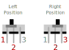

Standard Single Pole Double Throw (SPDT) slide switch.

<wokwi-slide-switch />

## Pin names

| Name | Description     |
| ---- | --------------- |
| 1    | Left terminal   |
| 2    | Common terminal |
| 3    | Right terminal  |

The slide switch has three pins. Pin 2 (in the middle) is the common pin. Depending on the position
of the switch's handle, it's connected to either pin 1 or 3:

| Handle position | Description           |
| --------------- | --------------------- |
| Left            | Shorting pins 1 and 2 |
| Right           | Shorting pins 3 and 2 |

The following diagram illustrates the connections inside the slide switch. You can see the gray sliding
contact that moves together with the handle and creates a connection between pin 2 and either pin 1 or 3:

## Attributes

| Name   | Description                                                          | Default value |
| ------ | -------------------------------------------------------------------- | ------------- |
| value  | Initial position of the slide switch: "" for left, "1" for right | ""           |
| bounce | Set to "0" to disable bouncing                                       | ""            |

### Bouncing

When you move a physical slide switch, the circuit opens and closes tens or hundreds of times.
This phenomenon is called [Bouncing](wokwi-pushbutton#bouncing).

Wokwi simulates switch bouncing by default. You can disable the bouncing simulation for individual switches by setting their "bounce" attr to "0":

`{ "bounce": "0" }`

## Simulator examples

- [Slide Switch and LED](https://wokwi.com/projects/288276100805558797) - Using a slide switch to toggle an LED
- [Slide Switch and 2 LEDs](https://wokwi.com/projects/288278249939665421) - A slide switch toggles between 2 LEDs
- [Digital Pin Output Switching](https://wokwi.com/projects/292033853022798344) - A slide switch redirects the output of a digital pin to one of two LEDs
